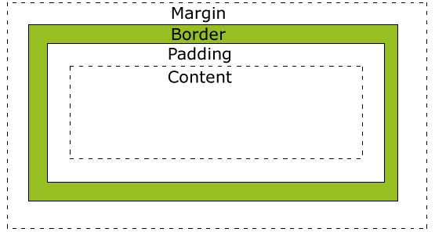

- ###  animation & transition & transform
- 题目: 在CSS3中要使元素由一种样式转换成另一种样式，怎么实现
- 解答: 
    + `animation`
        产生一个动画效果
        * 创建一个动画 @keyframe
        * 将动画绑定在某个 CSS 样式中
        * 动画具有的属性
            - `@keyframes`
            - `animation-name` 动画的名称
            - `animation-duration` 持续时间
            - `animation-timing-function` 时间曲线
            - `animation-delay` 何时开始
            - `animation-iteration-count` 动画播放的次数
            - `animation-direction` 规定动画下一个周期是否逆向的播放
            - `animation-play-state` 规定动画是否正在运行或者终止
            - `animation-fill-mode` 规定动画初始和结束时候的状态
        *  在 javascript 使用 `animationend` 事件监听动画是否完成
    + `transition`
        当一个样式过度到另一个样式的时候添加效果，其属性有
        * `transition-property` 需要过度的 CSS 样式
        * `transition-duration` 持续时间
        * `transition-timing-function` 时间曲线(ease)
        * `transition-delay` 过渡效果何时开始
        * 在javascript中可以监听 `transitionend` 事件来知道过度结束
    + `transform`  
     `transform` 转换可以分为 2D 转换和 3D 转换
        * `matrix( n,n,n,n,n,n )`
        * `translate( x,y )` 移动元素
        * `translateX( n )`
        * `translateY( n )`
        * `scale( x,y )` 改变元素的高度和宽度
        * `scaleX( n )`
        * `scaleY( n )` 
        * `rotate( angle )` 旋转
        * `skew( x-angle,y-angle )` 倾斜旋转
        * `skewX( angle )`
        * `skewY( angle )` 
        * 还有一系列转换的 3D 方法
            - `rotate3d( x,y,z,angle )` 
- [示例](animation&transition&transform.html) 

---    
- ###  margin & padding
- 题目: margin-top, padding-top 的值是百分值得时候如何计算
- 解答: margin 和 padding 使用百分号设置都是基于其最近的父元素的 **width** 来确定的， 如果父元素没有设定 **width**，则使用父元素计算出来的 **width** (不管是 margin-top,margin-bottom,margin-left,margin-right)(padding也是同理)。
> 来自 《CSS权威指南》 的解释
> 我们认为，正常流中的大多数元素都会足够高以包含其后代元素(包括外边距)，如果一个元素的上下边距为父元素的height的百分数，就可能导致一个无限循环，父元素的height会增加，以适应后代元素的上下外边距，而相应的，子元素的上下外边距就会因为父元素的height改变而改变，从而形成循环。  
- [示例](margin&padding.html)

---
- ###  盒子模式
- 题目: 什么是盒子模式
- 解答: 盒子模型就是表示 HTML 中一个元素，其有 `margin + padding + border + content-width` 来构成。  
在 W3C 标准中，盒子的 width = margin + padding + border + content-width, 而对元素的 width 设置指定的值，只是设定了盒子中的 content-width 的宽度，其总宽度还需要在计算。   
在 IE 之前的怪异模式下，设置元素的 width，就是指定了盒子中的 content-width + padding + border。 
- 

---
- ### css position
    + css2中 `position` 包括
        * `absolute` 绝对定位，相对于不是 `static` 定位的第一个父元素 
        * `static` (默认值)没有定位，元素出现在正常流中
        * `fixed` 绝对定位，相对于浏览器窗口
        * `relative` 相对定位，相对于自身本来应该在的位置
        * `inherit` 规定从父元素继承position属性

---
- ### css display
    + css2中 `display` 主要包括
        * `none` 此元素不会被显示
        * `inline` 显示为内联元素，前后没有换行符
        * `inline-block` 显示为行内块元素
        * `block` 显示为块元素，前后带换行符
        * `table` 作为块级表格来显示，表格前后带有换行符
        * `list-item` 作为列表显示
        * `flex(css3)` [伸缩性布局](http://www.ruanyifeng.com/blog/2015/07/flex-grammar.html)[实例](http://www.ruanyifeng.com/blog/2015/07/flex-examples.html)
---
- ### css 优先级
    + 首先考虑权重( `!important` ),加了该权重的优先级最高。
    + 其次看特殊性 ( 0,0,0,0 )
        * 内联样式 ( 1,0,0,0 )
        * id选择器 ( 0,1,0,0 )
        * 类选择器，属性选择器，伪类(`:link`,`:active`,`:hover`,`:visited`) ( 0,0,1,0 )
        * 元素和伪元素 ( 0,0,0,1 )
        * 通配符 ( 0,0,0,0 )
    + 最后看声明的顺序
    + 补充：如果class选择器超过 255 个，不同的浏览器会表现不同。有的浏览器( FF,IE )认为class选择器的优先级会超过id选择器

> css继承是从一个元素向其后代元素传递属性值所采用的机制。确定应当向一个元素应用哪些值时，浏览器不仅要考虑继承，还要考虑声明的特殊性，另外需要考虑声明本身的来源。这个过程就称为层叠。——《css权威指南》

---
- ### css Sprites
    + 原理: 将多个图合并在一张图片上，利用 `backgroud-position` 来定位显示图片。
    + 要求: 承载背景的图片最好是有大小的，否则容易把不属于该盒子的背景显示出来。
    + 优点: 减少http请求的次数，提高网站加载的性能
    + 确定: 可维护性比较低，在使用该技术下，图片的位置中的 `center` 之类的属性用不了了，降低了灵活性，同时由于需要把盒子的大小给定，则不利于平铺以及网页缩放。


---
- ### boostrap(4) 分辨率问题/布局问题
    + bootstrap识别宽度的分割点
        * `min-width` - 576px
        * `min-width` - 768px
        * `min-width` - 992px
        * `min-width` - 1200px

        * `max-width` - 575.98px
        * `max-width` - 767.98px
        * `max-width` - 991.98px
        * `max-width` - 1199.98px
        * 比如 `@media (min-width: 768px) and (max-width: 1199.98px) { ... }`
    + 布局等级对应关系
    
        |       | extra small | small | medium | large | extra large |
        | ----- | ----- | ----- | ----- | ----- | ----- |
        | Max container width | auto| 540px | 720px | 960px | 1140px |
        | class prefix | .col- | .col-sm- | .col-md- | .col-lg- | .col-xl- | 

---
- ### [IE,FF CSS的区别](CSS兼容性.html)

---
- ### 清除浮动的4中方法
    + 什么是CSS清除浮动
        在非IE浏览器中，如果元素的告诉是自适应(auto)的，并且元素内有内容是浮动的；在这种情况下，容器的高度不能自动伸长以适应内容的高度，使得内容溢出到容器外面而影响(甚至破坏)布局；这时就需要清除浮动。[float](float.html)

    + 清除浮动的4中方法
        * 在浮动元素的后面添加 `<div style="clear:both"></div>`
        * 通过设置父元素的 `overflow:hidden`
        * 父元素也设置浮动(不推荐)
        * 给浮动的父元素添加伪类 `:after`,通过其设置清除浮动
            ```css
                .father:after{
                    content:"";
                    width: 0;
                    height: 0;
                    font-size: 0;
                    display: block;
                    clear: both;
                }
                .father>.child:{
                     float: left;   
                };
            ```

---
- ### background属性
    + 其属性有
        * background-color 设置颜色
        * background-position 设置背景图像的位置(水平，垂直)
        * background-size 设置背景图像的大小(宽度，高度)(cover,contain)
        * background-repeat 规定如何重复背景图像
        * background-origin 规定背景图片定位区域(padding-box,border-box,content-box)
        * background-clip 规定背景图片剪裁区域(padding-box,border-box,content-box)
        * background-attachment 规定图像背景是否固定或者随着页面滚动(scroll，fixed)
        * background-image

---
- ### CSS渲染过程篇
    + 参考
        * [Accelerated Rendering in Chrome](https://www.html5rocks.com/zh/tutorials/speed/layers/)
        * [Web前端性能优化详解之CSS与JS加载](https://segmentfault.com/a/1190000015313069)
        * [前端性能优化（CSS动画篇](https://segmentfault.com/a/1190000000490328)
    + 相关术语
        * GPU: 图像处理器( Graphics Processing Unit),他是显卡的心脏,与CPU类似,只不过GPU是专为执行复杂的数学和几何计算而设计的，这些计算是图形渲染所必需的。
        * 纹理: 从主储存器(eg. RAM)移动到图像存储器(eg. GPU中的VRAM)的位图图像。一旦他被移动到GPU中，你可以将他匹配成一个网络几何体(就像游戏中的皮肤)。Chrome使用纹理来从GPU上获得大块的页面内容。通过将纹理应用到一个非常简单的矩形网络就能很容易匹配不同的位置和变形。
    + 学习Layer的Chrome工具
        * 在Render的tag下选中Layer borders，它会高亮屏幕上的层  
        
        其中蓝色网格表示瓦片，可以当成层的单元。
        * 选中Paint flashing可以在页面发生重绘的时候，在该元素上面看到发生绿光
    + 可以在Chrome的开发者工具中的peformance里查看是否页面消耗的时间
    + 层会在什么情况下创建
        * 3D或透视变换(perspective transform) css属性
        * 使用加速视频解码的`<video>`元素
        * 拥有3D(WebGL)上下文或加速的2D上下文的`<canvas>`元素
        * 混合插件(如Flash)
        * 对自己的opacity做CSS动画或使用一个动画变换的元素
        * 拥有加速CSS过滤器的元素
        * 元素有一个包含复合层的后代节点
        * 元素由一个z-index较低且包含一个复合层的兄弟元素
    + 从DOM到屏幕
        * 获取DOM并将其分割为多个层
        * 将每个层独立的绘制进位图中
        * 将层作为纹理上传至GPU
        * 复合多个层来生成最终的屏幕图像
    + 注意  
        需要注意的是，如果图层中某个元素需要重绘，那么整个图层都需要重绘。比如一个图层包含很多节点，其中有个gif图，gif图的每一帧，都会重回整个图层的其他节点，然后生成最终的图层位图。所以这需要通过特殊的方式来强制gif图属于自己一个图层（translateZ(0)或者translate3d(0,0,0)），CSS3的动画也是一样（好在绝大部分情况浏览器自己会为CSS3动画的节点创建图层）

---
- ### css3中的媒体查询
    + 媒体查询(`@media`)的意义:可以在不改变页面内容的情况下，为特性的一些输出设备定制显示效果
    + 组成:媒体类型和一个或者多个检测媒体特性的条件表达式组成
        * 媒体类型  
            - all 所有媒体
            - braille 盲文触觉设备
            - embossed 盲文打印机
            - print 手持设备
            - projection 打印预览
            - screen 彩屏设备
            - speech ‘听觉’类似的媒体类型
            - tty 不适用像素的设备
            - tv 电视
        * 表达式中国可以使用 not,and,only 来构建复杂的媒体查询。使用 `,` 隔开每个表达式相当于使用or，只要有一个表达式为true即可,not关键字应用于整个表达式，不可以对单一的某个单独使用
        ```css
            @media (min-width: 700px) and (orientation: landscape) { ... }
            @media (min-width: 700px), handheld and (orientation: landscape) { ... }

            /*以下两个等价*/
            @media not all and (monochrome) { ... }
            @media not (all and (monochrome)) { ... }

            /*以下两个等价*/
            @media not screen and (color), print and (color)
            @media (not (screen and (color))), print and (color)
        ```
    + 可检测的媒体特性
        * width: 视口宽度
        * height: 视口高度
        * device-width: 渲染表面的宽度
        * device-height: 渲染表面的高度
        * orientation: 检测设备处于横向还是纵向
        * aspect-ratio: 基于视口宽度和高度的宽高比(比如 16/9)
        * device-aspect-ratio: 和aspect-ratio类似，基于设备渲染平面宽度和高度的宽高比
        * color: 每种颜色的位数
        * color-index: 设备的颜色索引表中的颜色数
        * monochrome: 检测单色帧缓冲区每像素所使用的位数
        * resolution: 用来检测屏幕或打印机的分辨率
        * scan: 电视机的扫描方式
        * grid: 用来检测输出设备是网格设备还是位图设备
        * min-device-pixel-ratio: 最小像素比

---
- ### 移动端开发中`max-device-width`与`max-width`的区别
    device-width指的是渲染的屏幕大小，也就是分辨率的大小。比如pihone4的分辨率是 640 * 960，也是说它的 device-width 是 640px，但是他的 width 是 340px，原因在于他是使用两个像素来渲染一个css像素的。

---
- ### BFC
    + 参考:[CSS之BFC、IFC、GFC和FFC](https://blog.csdn.net/tianxieliuhong/article/details/53375141),[ 
BFC原理及其应用](https://blog.csdn.net/wky_csdn/article/details/73554720)
    + 简单解释:
        * css的最小单位是Box(盒子)，而Box又分为
            - block-level box
            - inline-level box
            - run-in box
        * 对应于box也有不同Formatting Context(一个决定如何渲染文档的容器),Formatting Context是页面的一块渲染区域，并且有一套渲染规则，它决定了其子元素将如何定位，以及和其他元素的关系和相互作用。
            - Block formatting context(BFC,块级格式化上下文)
            - inline formatting context(IFC)
            - GFC
            - FFC
        * [BFC布局规则](BFC_test.html)
            - 内部的Box会在垂直方向，一个接一个地放置
            - Box垂直方向的距离由margin决定，属于同一个BFC的两个相邻Box的margin会发生重叠
            - 每个元素的margin box的左边，与包含块border box的左边相接触，即使浮动也是如此。
            - BFC的区域不会与float box重叠
            - BFC就是页面上的一个隔离的独立容器，容器里面的子元素不会影响到外面的元素，反之也是如此
            - 计算BFC的高度时，浮动元素也参与计算
        * 那些元素会生成BFC
            - 根元素
            - float属性不为none
            - position属性为absolute或者是fixed
            - display为inline-block、table-cell、table-caption、flex、inline-flex，overflow不为visible

---
- ### `<head>`中css的加载顺序
    浏览器会并行加载css，加载完毕并且DOM Tree构建完毕后开始解析css文件，并构建CSSOM Tree。由于css是并行加载的，所以哪个css文件先加载完，就先解析哪个文件。如果先解析后面的css文件，则再解析前面css文件的时候，会把后面css文件没有的规则而前面css规则有的合并过来。

---
- ### 不换行必须要设置哪些项
    + word-break 规定自动换行的处理方法(换行方式)
    + letter-spacing 增加或者减少字符间的换行(字符间距)
    + white-space 设置如何处理元素内的空白(空白符号的处理)
    + word-spacing 增加或者减少单词之间的空白(词间距,对中文不管用,原因在于英语词与词之间是空白，而中文是紧挨着的)


    
