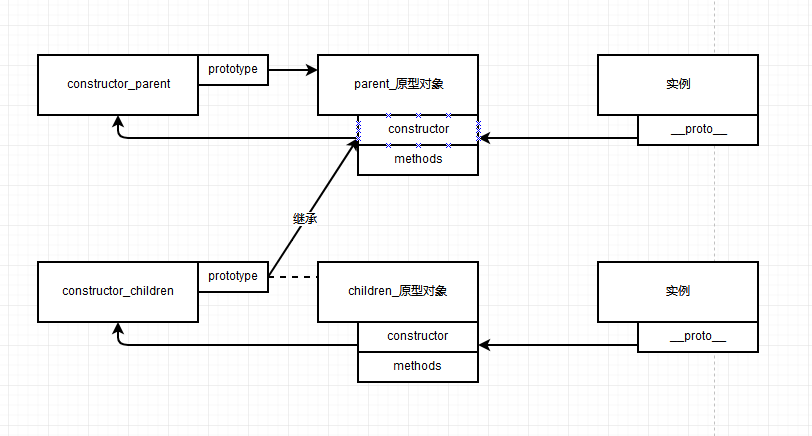

## 新的类语法，class定义与基本特性
- 语法  
    ES6 的类是一种语法糖，本质上还是基于原型来实现继承的。
    ```javascript
        class className{
            // 构造函数
            constructor(){
            }
            //method....
            method(){

            }
        }
    ```

- 特点
    + 类的类型还是 `function`

        ```javascript
            class myClass{
                constructor(){
                    console.log("i have birthed");
                }
                show(){
                    console.log(1);
                }
            }
            console.log(myClass); //function myClass()
            console.log(myClass.prototype);
            //Object { … }
            //constructor: function myClass()
            //show: function show()
        ```

        ```javascript
            class myClass{
            }
        
            function myClass(){
            }

            //报错 SyntaxError: redeclaration of class myClass

        ```

    + 类名就是构造函数，`类名( constructor ) === 类名.prototype.constructor`  
        在 ES5 中的原型链关系如下图:  
          
        在 ES6 中，类名就上图中的 `constructor`。

    + 实例化也是用关键字 `new` ，否则会报错。

    + 类的所有方法都是扩展在 `类名.prototype` 上, 参考上面的例子。

    + 实例的 `constructor` === `类名.prototype.constructor`  
        实例上没有 `constructor`，实例是通过自身的属性 `__proto__` 来找到原型中的 `constructor`。

    + 可以使用 `Object.assign(类名.prototype,{//method...})` 来为类扩展方法。 其就是添加在原型对象上。`Object.assign(类名,{//method...})` 添加的是静态方法。

    ```javascript
           class myClass{
                constructor(){
                    this.privated = function(){
                        //私有
                        console.log("constructor method private myClass");
                    }
                }
                //公有
                publicd(){
                    console.log("prototype method public myClass");
                }
            }
            //静态
            myClass.staticd = function(){
                console.log("static method static myClass")
            }

            function Fn(){
                //私有
                this.privated = function(){
                     console.log("constructor method private Fn");
                }
            }
            //公有
            Fn.prototype.publicd = function(){
                    console.log("prototype method public Fn");
            }
            //静态
            Fn.staticd = function(){
                 console.log("static method staticd Fn");
            }


            console.log(new myClass());
            console.log(new Fn());
            console.log(myClass);
            console.log(Fn);


    ```

    + 类的内部所有方法都是不可枚举的。 (使用 `Object.keys(类名.prototype)` 看看)
    
        ```javascript
            console.log(Object.keys(myClass.prototype)); //Array []
        ```

    + 类的属性名可以用计算表达式.(` $a = 'aaa'; [$a] = 123`)

    + `constructor` 方法是类的默认方法，通过 `new` 命令生成对象的时候， 会自动调用该方法。如果没有显示的定义，一个空的 `constructor` 会被默认添加。默认返回值为实例( `this` )，可以用 `return ` 显式返回其他对象。


