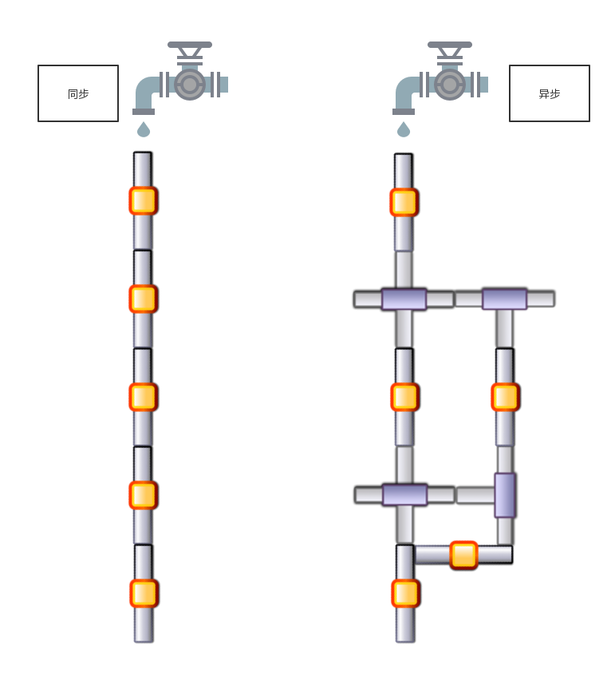

## promise 对象 
- ### 什么是异步  
    异步，就是为了提高效率，把一个一个的任务分给其他人，在其他人完成后，再来和自己汇报这个过程。  
    在 javascript 中表现为，把一段代码封装成程序。作为回调函数传递给一个事件 (比如 `click` 事件等)，当这个事件被触发的时候，执行这个回调函数。这就创建了一个异步程序。

- ### 异步和同步的区别  
      
    同步的时候，只能作为上一个事件才能做下一个事件。而异步可以先做下一个事情，等上一个事件的左立结果出来了再根据处理结果去干其他的。

- ### 一个循环中的异步
    
    ```javascript
        //因为是异步，所以在计时器的等待被扔给了别的内存，主线继续执行，所以，等过了 2s 后 i 已经是5了、
        for( var i = 0; i < 5; i++ ){
            setTimeout(function(){
                console.log(i); // 5个i
            },2000)
        }
        console.log( i ) //5 比定时器的5先打印出
    ```

- ### promise的基本用法  
    promise是异步机制，提供了异步统一的接口。
    + 基本用法示例
    ```javascript
        //声明一个 Promise 对象的示例，其接受 2 个 参数(function)。
        //第一个参数 (resolve) 表示响应成功执行的回调函数。使用 Promise 对象中的 then() 方法捕获。 
        //第二个参数 (reject) 表示响应失败执行的回调函数。使用 Promise 对象中的 catch() 方法捕获(then 方法同样可以捕获)。 
        
        //then() 方法接受 2 个参数。 第一个是响应成功执行的回调函数
        //第二个参数是相信失败执行的回调函数。
        //如下例,在resolve, reject 传递的参数，在捕获的时候可以获取。
        var oPromise = new Promise((resolve,reject)=>{
            let rand = Math.random() * 100;

            if(rand > Math.random() * 100){
                resolve("rand: "+ rand +" is bigger");
            }else{
                reject({a:2});
            }
        })
        //方法1
        // oPromise.then((res)=>{
        //  console.log(res);
        // }).catch(err=>{
        //  console.log(err);
        // })
        //方法2
        oPromise.then(res=>{
            console.log(res);
        },err=>{
            console.log(err + " err");
        })
    ```

- ### Promise 状态
    + pending (default)
    + resolve
    + reject

    初始状态都是 pending，随着任务的完成变成状态 resolve,reject。 可以通过打印 primise (`console.log(oPromise)`) 来查看当前状态。

    并且 Promise 的状态不可逆。不可以从 resolve 再变成 reject。 反之亦然。

- ### Promise 的链式调用
    ```javascript
        let oPromise = new Promise(function(resolve,reject){
            resolve("hehe");
        })

        oPromise.then(value=>{
            return value + "haha";
        }).then(value => {
            console.log(value); //hehehaha
        }).then(value => {
            console.log(value); //undefined 上一步没有返回值
        })

        //在then方法中直接 return 一个值，相当于简写了 return value + "haha" 
        //return new Promise((resolve,reject)=>resolve( value + "haha" ))
    ```

- ### promise 的 `all` 和 `race` 方法
    + `all`  
        * 该方法是 `Promise` 上的一个静态方法
        * `all` 方法接受一个 `Promise` 对象的数组。只有这个数组里所有的 `Promise` 对象都 `resolve` 了，才执行 `all` 方法。
    ```javascript
        function task(n){
            return new Promise((resolve,reject)=>{
                setTimeout(function(){
                    resolve(n);
                },n*1000)
            })
        }

        Promise.all([
            task(1),
            task(2),
            task(3),
            task(4),
            task(5)
        ]).then(value=>{
            console.log(value); //Array(5) [ 1, 2, 3, 4, 5 ]
        })
    ```

    + `race`  
        * 该方法是 `Promise` 上的一个静态方法
        * `race` 方法接受一个 `Promise` 对象的数组。当数组里任意一个 `Promise` 对象 `resolve` 或者 `reject` 了，程序终止。
    ```javascript
                function task(n){
            return new Promise((resolve,reject)=>{
                setTimeout(function(){
                    resolve(n);
                },n*1000)
            })
        }

        Promise.race([
            task(2),
            task(6),
            task(1),
            task(4),
            task(5)
        ]).then(value=>{
            console.log(value); //1
        })
    ```
