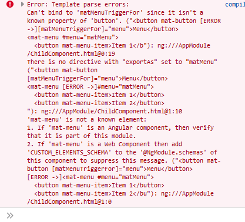
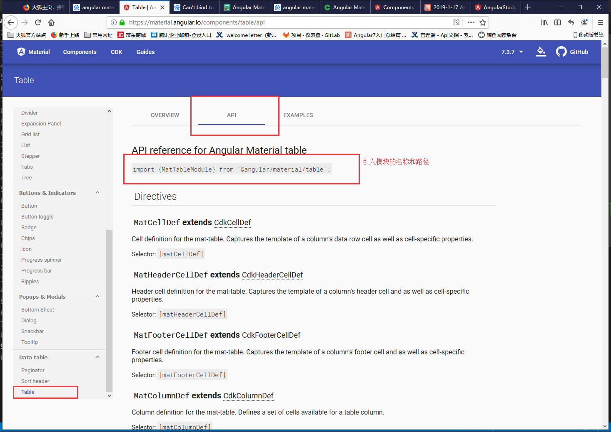

# angular material使用

## 开始

  使用 `npm i -save @angular/materail @angular/cdk @angular/animations` 本地安装 angular material。  
  **一定要安装正确，如果在项目过程中导入发生错误，可以考虑引用不正确**  

## 引入BrowserAnimationsModule

  在使用各个component之前，必须 **先在module中引入该模块**，以此来支持component中的动画。如果没有引入该模块，直接引入其他模块都会报错。

  ```typeScript
    import {BrowserAnimationsModule} from '@angular/platform-browser/animations';

    @NgModule({
    ...
    imports: [BrowserAnimationsModule],
    ...
    })

  ```

  

## 引入需要使用的component

  具体使用哪个component，去查看该component的API，可以看到该component需要引入的路径。
  
  [angular material](https://material.angular.io/components/autocomplete/overview)

  
