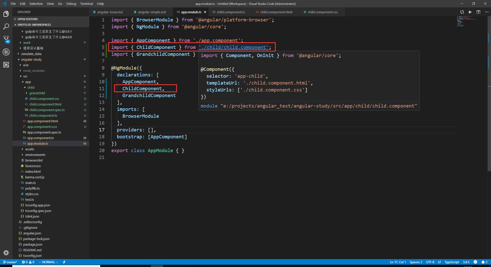
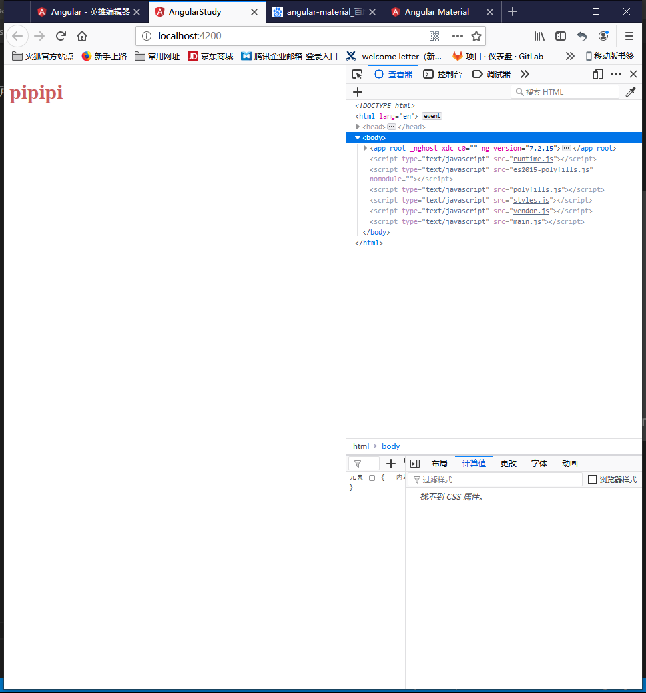
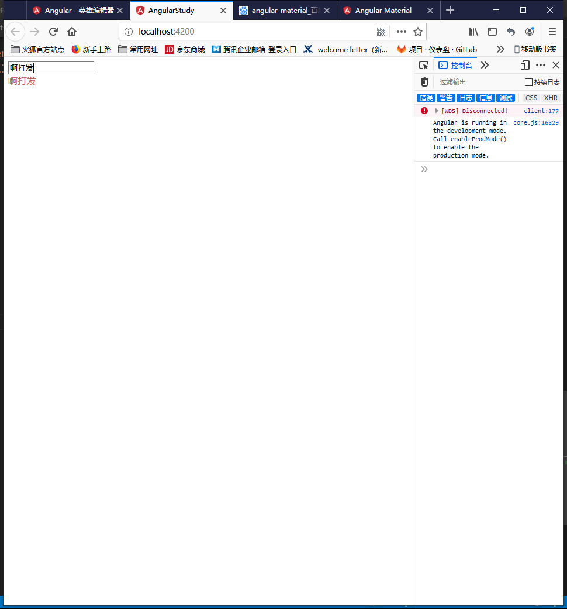
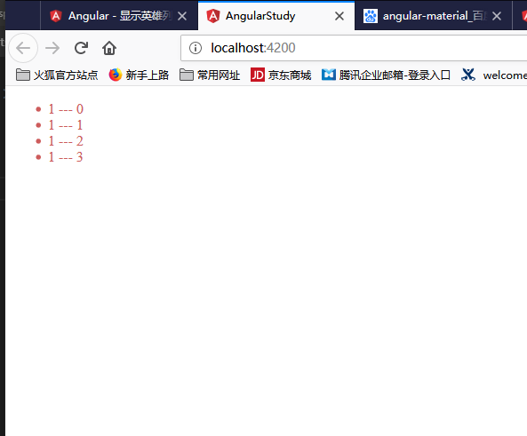
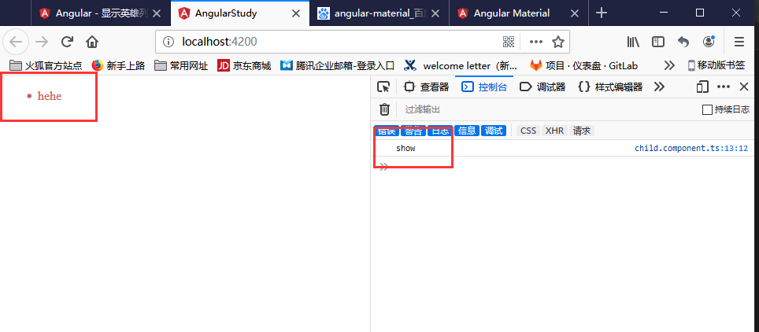
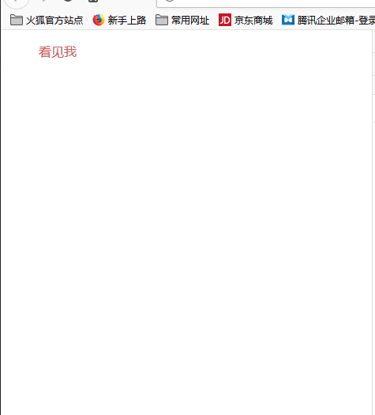
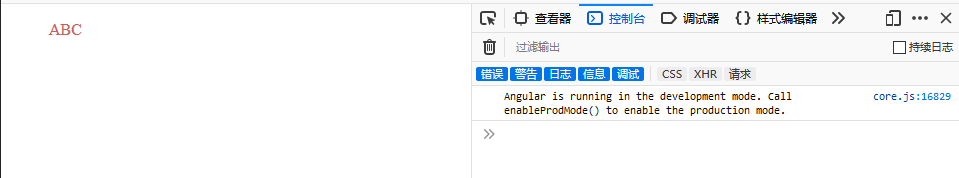

# angular入门练习随记

- ## 安装`angular-cli`

  在使用angular之前，必须全局安装`angular-cli`，使用命令 `npm i -g @angular/cli`

- ## 安装简单的`angular`程序，并且启动

  使用`ng new [project-name]`, `ng serve -o`; `-o`表示自动在浏览器中打开页面; 可以使用 `ng generate component [component-name]` 来新建组件。使用该命令来新建组件会自动在app-module中注册该组件，也会默认创建4个文件(除了module文件)，如下所述。  
  

- ## 简单介绍

  在angular目录下的 `src/app/`下默认会生成 5个文件

  - app.component.html 这个页面包含html代码，是整个模块的视图层
  - app.component.css  这个文件包含管理该模块的css
  - app.component.ts   这个文件是相当于整个模块的controller，链接着视图层和数据层，包含着页面显示数据的逻辑代码
  - app.component.spec.ts  **这个还不知道是什么**
  - app.component.module.ts 这个文件是整个模块的入口文件(在我看来)，整个模块的引用依赖都在这个文件中完成

- ## angular常规使用
  
  - **向html注入自定义变量**  
  使用 `{{ param }}` 向 .html文件注入变量，变量的声明在 .component.ts文件中;下面例子创建一个新组建child，并在app组件中引入child从而显示child组件的内容。

  ```html
    <!-- app.component.html -->
    <app-child></app-child>
  ```

  ```html
    <!-- child.component.html -->
    <div> {{ show }} </div>
  ```

  ```css
    div{
        color: indianred;
    }
  ```

  ```typeScript
    // child.component.ts
    import { Component, OnInit } from '@angular/core';

    //@Component是一个装饰函数，用于为该组件指定数据元
    @Component({
        selector: 'app-child', //在其他html页面引用时，所写的标签
        templateUrl: './child.component.html', //自己的html代码url
        styleUrls: ['./child.component.css'] //引入的css的url
    })

    //导出这个类
    export class ChildComponent implements OnInit {

    constructor() { }
        //该组件的生命钩子，在组件创建之前执行
        ngOnInit() {}
        show = 'pipipi';
    }
  ```

  显示效果如下图:  
  

  ---

  - **双向绑定变量**
  使用 `[(ngModel)]` 来给变量进行双向绑定。**注意！使用 `[(ngModel)]`必须引入模块`FormsModule`，并且在写入`imports`**

  ```html
    <!-- child.component.html -->
    <input [(ngModel)] = 'connect'/>
    <div> {{ connect }} </div>
  ```

  ```typeScript
    // child.component.ts
    export class ChildComponent implements OnInit {
    constructor() { }
        ngOnInit() {}
        connect = '';
    }
  ```

  ```typeScript
    // app.module.ts
    import { BrowserModule } from '@angular/platform-browser';
    import { NgModule } from '@angular/core';
    import { FormsModule } from '@angular/forms';

    import { AppComponent } from './app.component';
    import { ChildComponent } from './child/child.component';

    @NgModule({
      declarations: [
        AppComponent,
        ChildComponent,
      ],
      imports: [
        BrowserModule,
        FormsModule
      ],
      providers: [],
      bootstrap: [AppComponent]
    })
    export class AppModule { }
  ```

  显示效果如下图:

  ---

  - **循环**

  ```html
    <!-- child.component.html -->
    <!-- 
      items = [{name:1},{name:1},{name:1},{name:1}]
     -->
    <ul>
      <li *ngFor = "let item of items; let i = index">
        {{ item.name }} --- {{ i }}
      </li>
    </ul>
  ```

  显示效果如下图:

  ---

  - **添加事件**

  ```html
    <!-- child.component.html -->
    <ul>
      <li (click)="show()">
        hehe
      </li>
    </ul>
  ```

  ```typeScript
    // child.component.ts
    export class ChildComponent implements OnInit {
    constructor() { }
        ngOnInit() {}
        show() {
          console.log('show');
        }
    }
  ```

  显示效果如下图:

  ---

  - **判断**

  ```html
    <!-- child.component.html -->
    <div *ngIf="false">看不见我</div>
    <div *ngIf="true">看见我</div>
  ```

  显示效果如下图:

  ---
  
  - **管道**

  ```html
    <!-- child.component.html -->
    <div>{{'abc' | uppercase}}</div>
  ```

  显示效果如下图:

## 案例学习

1. 带`*`的指令在angular中代表结构性指令。也就是会通过添加，删除和操纵他们的宿主元素等方式塑造或重塑DOM结构。比如 `*ngFor`,`*ngIf`
2. 使用 `[]` 为判定语法，用来表示在html模板中表示动态的属性比如 `[title]="123"`。 使用 `(click)="fn()"` 来在html中绑定事件
3. 装饰器
  - `@Component`是一个组件装饰器，在这里输入组建的元数据，包括模板(html),样式(css),标签(在其他页面使用的tag)

  ```js
    import { Component, OnInit } from '@angular/core';
    @Component({
      selector: 'app-product-alerts',
      templateUrl: './product-alerts.component.html',
      styleUrls: ['./product-alerts.component.css']
    })
    export class ProductAlertsComponent implements OnInit {
      constructor() { }
      ngOnInit() { }
    }
  ```

  - `@input`是一个输入装饰器，表示从外部接受的数据。其输入是由tag标签通过标签属性引入的。

  ```js
    import { Component, OnInit } from '@angular/core';
    import { Input } from '@angular/core';
    //other code ...
    export class ProductAlertsComponent implements OnInit {
      @Input() product;
      constructor() { }
      ngOnInit() { }
    }
  ```

  ```HTML
    <app-product-alerts [product]="product"></app-product-alerts>
  ```

  - `@Output`装饰器和 `EventEmitter`事件发射器。两个一般搭配使用。作为输出信息的方法。 **父组件通过监听事件的方法来获取子组件所发出的信息**

  ```js
  //child-component
  export class ProductAlertsComponent {
    @Input() product;
    @Output() notify = new EventEmitter();
  }

  //father-component
  export class ProductListComponent {
    products = products;

    share() {
      window.alert('The product has been shared!');
    }

    onNotify() {
      window.alert('You will be notified when the product goes on sale');
    }
  }
  ```

  ```html
  <p *ngIf="product.price > 700">
    <button (click)="notify.emit()">Notify Me</button>
  </p>
  ```

  - `@Injectable`装饰器把所在的类标注为 **依赖注入系统** 的参与者之一，它所接受的参数也是注入所需的 **元数据**。

  ```js
    import { Injectable } from '@angular/core';

    @Injectable({
      providedIn: 'root',
    })
    export class HeroService {

      constructor() { }

    }
  ```

4. 路由：使用路由的需要现在 **module文件** 中引入路由信息。如要在每个 **组件** 中获取路由信息，需要在该组件中导入路由对象来引入路由信息，在html中通过`[routerLink]="['/product',productId]"` 来使用路由。
  
  ```js
  //app.module.ts
  @NgModule({
  imports: [
    BrowserModule,
    ReactiveFormsModule,
    RouterModule.forRoot([
      { path: '', component: ProductListComponent },
      { path: 'products/:productId', component: ProductDetailsComponent },
    ])
  ],

  //xxx.component.ts
  import { ActivatedRoute } from '@angular/router';
  export class ProductDetailsComponent implements OnInit {
    product;

    constructor(
      private route: ActivatedRoute,
    ) { }
    ngOnInit() {
      this.route.paramMap.subscribe(params => {
        this.product = products[+params.get('productId')];
      });
    }
  }
  ```