# 在是angularJS 1.xx 中所遇到的问题

## 目录

---

1. 关于select选择框

---

### 关于select选择框

需求：有个一数组，假设是如下所示，希望做一个二级联动选择框，取得子选择框的name，也就是my_name字段.

```json

const list = [
    {
        "id": 1,
        "name": "hihi",
        "child":[
            {
                "f_id":1,
                "my_name": "pipi"
            },
            {
                "f_id":1,
                "my_name": "kiki"
            },
            {
                "f_id":1,
                "my_name": "gigi"
            }
        ]
    },{
        "id": 2,
        "name": "bubu",
        "child":[
            {
                "f_id":2,
                "my_name": "pupu"
            },
            {
                "f_id":2,
                "my_name": "kuku"
            },
            {
                "f_id":2,
                "my_name": "gugu"
            }
        ]
    },{
        "id": 3,
        "name": "hehe",
        "child":[
            {
                "f_id":3,
                "my_name": "pepe"
            },
            {
                "f_id":3,
                "my_name": "keke"
            },
            {
                "f_id":3,
                "my_name": "gege"
            }
        ]
    },
]

```

基本思路： 先做一个二级联动的选择框， 父选择框绑定变量为 **选择项目的索引**存储在变量 s_index中，子选择框根据这个索引找到要 **遍历的目标**遍历存储在变量 c_name中。最后可以获取 c_name，代码如下。

```html
<!-- index.html -->    
<select name="test" id="test" ng-model="s_index" ng-change="changeMy()">
  <option value="{{$index}}" ng-repeat="f in list track by $index">{{f.name}}</option>
</select>

<select name="testc" id="testc" ng-model="c_name">
  <option value="{{c.my_name}}" ng-repeat="c in list[s_index].child">{{c.my_name}}</option>
</select>

<button type="button" ng-click="show()">click</button>
<div>
  {{result}}
</div>
```

```js
/* js/controller.js */
var phonecatApp = angular.module('phonecatApp', []);

phonecatApp.controller('phonecatApp', function($scope){
    $scope.list = [...];
    $scope.show = show;
    //需求要的东西
    $scope.result = {
        my_name: ""
    }

    $scope.show = show;

    //展示需求要的东西
    function show(){
        $scope.result["my_name"] = $scope.c_name;
    }
```

可以看见轻松的实现了联动并且获取了绑定的值，c_name;  
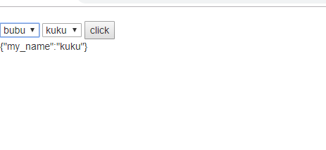  

**需求变动**： 我还要获取父选择框的id，即字段 id。

想着这也不难，绑定一个 `change`事件，将id传过去不就好了，然后在处理不就好了。哈哈，少年还是想的太简单了！！改动代码如下:

```html
<!-- index.html -->
<!-- 添加指令changeMy(f.id) -->
<select name="test" id="test" ng-model="s_index" ng-change="changeMy(f.id)">
  <option value="{{$index}}" ng-repeat="f in list track by $index">{{f.name}}</option>
</select>

<select name="testc" id="testc" ng-model="c_name">
  <option value="{{c.my_name}}" ng-repeat="c in list[s_index].child">{{c.my_name}}</option>
</select>

<button type="button" ng-click="show()">click</button>
<div>
  {{result}}
</div>
```

```js
/* js/controller.js */
/*改动添加 $scope.changeMy = changeMy;*/
var phonecatApp = angular.module('phonecatApp', []);

phonecatApp.controller('phonecatApp', function($scope){
    $scope.list = [...];
    //需求要的东西
    $scope.result = {
        my_name: "",
        f_id: ""
    }

    $scope.show = show;
    $scope.changeMy = changeMy;

    //展示需求要的东西
    function show(){
        $scope.result["my_name"] = $scope.c_name;
  
    }

    //父选择框change触发
    function changeMy(id){
        $scope.result["f_id"] = id;

    }
```

然后，我一点击 button，oh~~~~
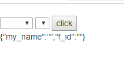
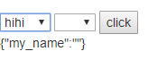
发现$scope.result["f_id"]竟然没了，机智的我打印看看

发现传过来的值竟然是 `undefined`!! 为什么为什么！！  
**问题1: 为什么不可以通过change传递id**

既然不能通过change事件传递id，那我就直接在data源中根据父选择框绑定的index找，**这里说一下为什么不直接给父选择框的值绑定id而是绑定index，因为在我现在想来，这是为了更加方便的找到子选择框的集合。同时做二级联动的时候，一定要记得在父选择框变化的时候，清空子选择的值**，代码如下

```html
<!-- index.html -->
<!-- 改动把changeMy(f.id) -> changeMy() -->
<select name="test" id="test" ng-model="s_index" ng-change="changeMy()">
  <option value="{{$index}}" ng-repeat="f in list track by $index">{{f.name}}</option>
</select>

<select name="testc" id="testc" ng-model="c_name">
  <option value="{{c.my_name}}" ng-repeat="c in list[s_index].child">{{c.my_name}}</option>
</select>

<button type="button" ng-click="show()">click</button>
<div>
  {{result}}
</div>
```

```js
/* js/controller.js */
//改动changeMy函数的代码
function changeMy(){
  $scope.result["f_id"] = $scope.list[$scope.s_index].id;
}
```

添加的需求也完成了！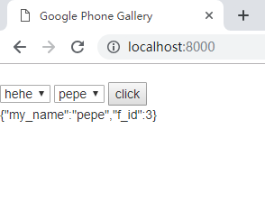  

**需求再变动**： 要求两个select可以设置初始选项。

无知的我想着：既然都是两个select分别和 s_index,c_name 双向绑定，那我就设置这两个值就好呀。于是添加

```js
/* js/controller.js */
$scope.s_index = 1;
$scope.c_name = "kuku";
```

结果只有子选择框有反应，父选择框没反应！！为什么！说好的双向绑定呢！  
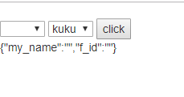  
**问题2：查看html节点发现：莫名其妙多了一个li，并且还是selected的! what? why?并且在子选择框内没有多余的空空白**
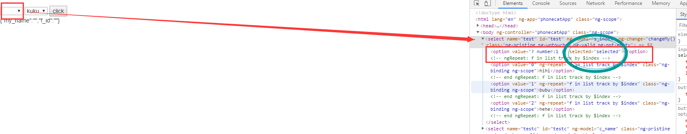

做一个实验，看看`ng-model`在没有其他干扰的条件下，是不是可以让select选择框有默认值

```html
<!-- index.html -->
<select name="" id="" ng-model="test_select">
  <option value="1" selected>1</option>
  <option value="2">2</option>
  <option value="3">3</option>
  <option value="4">4</option>
  <option value="5">5</option>
</select>
{{ test_select }}
```

```js
/* js/controller.js */
$scope.test_select = 5;
```

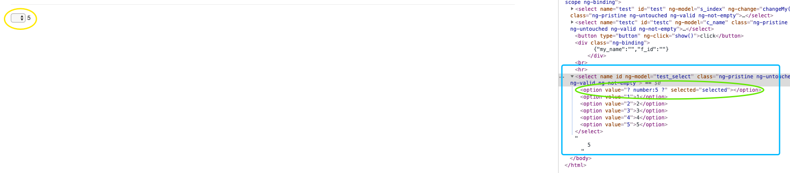

<s>可以看出，这angular竟然又给我乱添加了一个节点。**那这个问题是不是这个节点弄的呢？**</s>

**这个地方纠正一点：这里没有绑定初始值成功是因为`$scope.test_select = 5;`这里设置的值为`number`类型，而选择框的值为`string`类型，所以出现空白节点，其`value='?number:5?'`。如果把`$scope.test_select = 5;`变成`$scope.test_select = '5';`就有初始值了。

<s>先把这个问题放一放，采用迂回方法使用`ng-selected`来让其做到有初始值。</s>

`ng-selected` 接受一个布尔值，如果是false则不选择；反之选择。

```html
<!-- index.html -->
<select name="" id="" ng-model="test_select">
  <option value="1">1</option>
  <option value="2" ng-selected="true">2</option>
  <option value="3">3</option>
  <option value="4">4</option>
  <option value="5">5</option>
</select>
{{ test_select }
```

<s>发现还是不行，不可以选择默认值。同时又出现了莫名其妙的节点。看来这个新增的节点是绕不过去了。</s>

从这点看来，这是因为在js中绑定的值优先级高于页面中selected方式。

现在来总结一下上面的问题：

1. 问题1: 为什么不可以通过change传递id
2. 问题2: 会莫名其妙多一个节点，同时被selected。

**对于问题1:**

**对于问题2:**

解决方法：

**总结一下：步骤在下面。会出现空白节点的原因有两点: 使用了`ng-model`绑定了值，但没有赋值；使用了`ng-model`绑定了值，赋值了，但值的数据类型与选择框里的value数据类型不相符**。可以在开发者工具中查看select中value的数据类型。而空白节点的出现就代表占据了selected的位置

**解决空白节点的方法**：

1. 如果使用`ng-repeat`则在repeat之前写一个默认的option，这样angular会默认选择该选项,所以不会生成空白节点。

   ```html
   <select name="" id="" ng-model="k">
   <option value="">null</option>
   <option value="{{$index}}" ng-repeat="c in list track by $index">{{c.name}}</option>
   </select>
   ```

   

2. 为绑定的`ng-model`设定初始值。

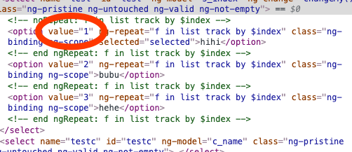

1. 使用 `ng-options`来生成option，则不会出现空白的option。

   使用的过程要注意，首先 `ng-options` **必须** 要和 `ng-model`搭配使用。其次，如果没有设定默认值，也就是 `ng-mode`所绑定的值没有被赋值时，同样也会生成空白节点。

   ```html
   <!-- index.html -->
   <select name="a" id="a" ng-model="a" ng-options="f.id as f.name for f in list"></select>
   ```

   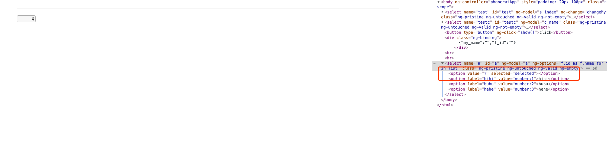

   

   在js添加`a`的默认值就可以避免这个问题

   ```js
   /* js/constroller.js */
   $scope.a = 2
   ```

   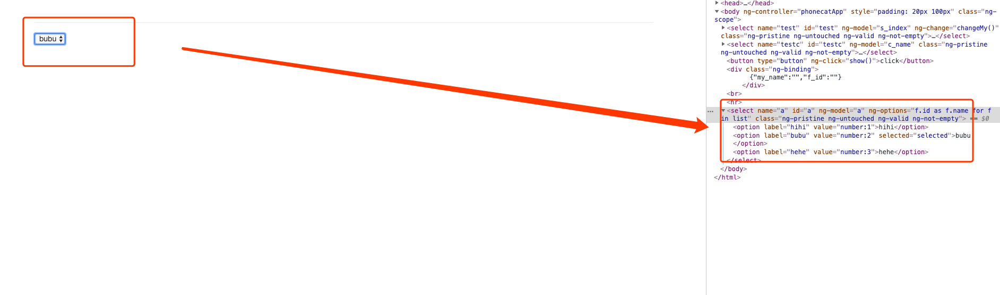

   可以看到上图中有初始值，同时没有多余的节点。

2. 找到空白节点出现的原因。通过上面的例子，在没有为select(绑定了`ng-model`)赋予初始值的条件下，angular会主动生成一个空白的`<li value="? number: 1 ?" selected></li>`。我认为这是`li`的作用有两点：

   1. 对用户来说，不会误以为选择了某一个选项，其实没有选择
   2. 对于开发者来说，为该变量设置了一个初始值，其值为空。为某一个变量赋初始值据说是一个好习惯喔

   有上面的想法，现在来实验一下不使用`ng-options`解决空白节点的问题:

   1. 不绑定任何变量`ng-model`，纯静态页面，看看是否会有空白节

   ```html
   <!-- index.html -->
   <select name="" id="">
     <option value="1">1</option>
     <option value="2">2</option>
     <option value="3">3</option>
     <option value="4">4</option>
     <option value="5">5</option>
   </select>
   
   <select name="" id="">
     <option value="{{c.name}}" ng-repeat="c in list">{{c.name}}</option>
   </select>
   ```

   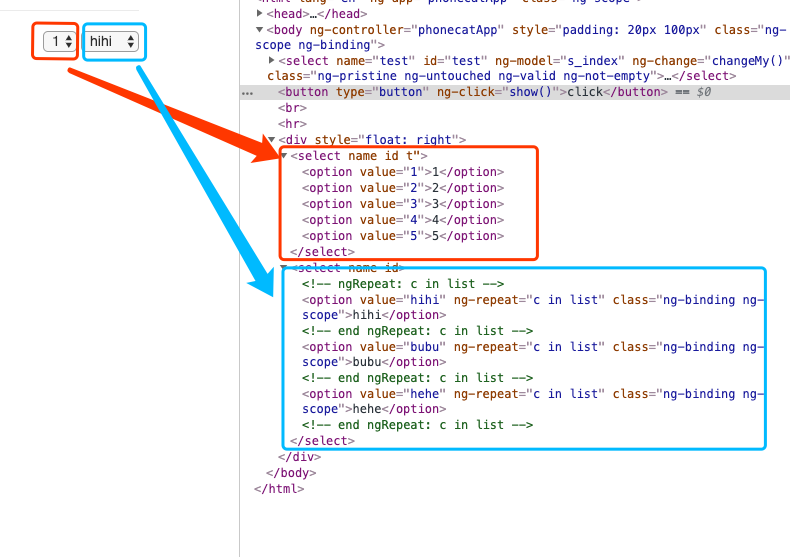

   发现没有只要不绑定`ng-model`，就没有空白节点，如果绑定了，<font color="red">就必须按照**严格的数据类型**来确定默认值。</font>

   


