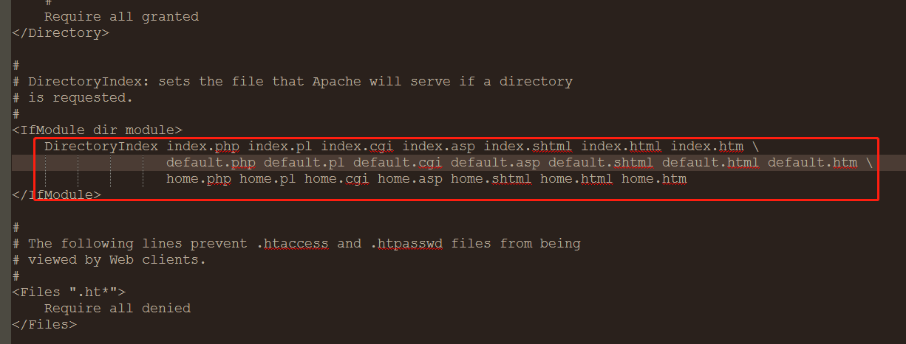
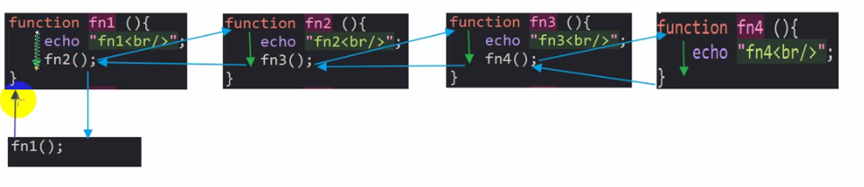
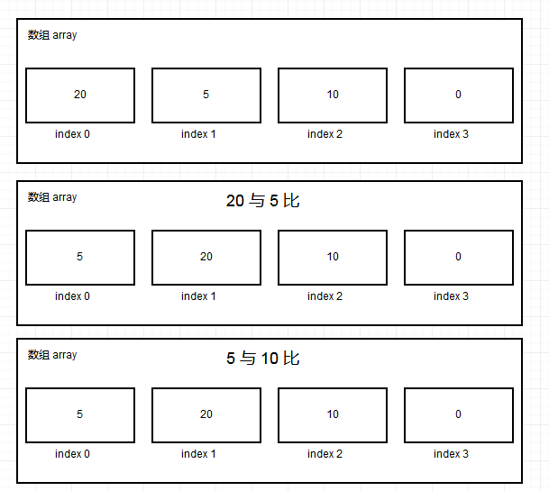
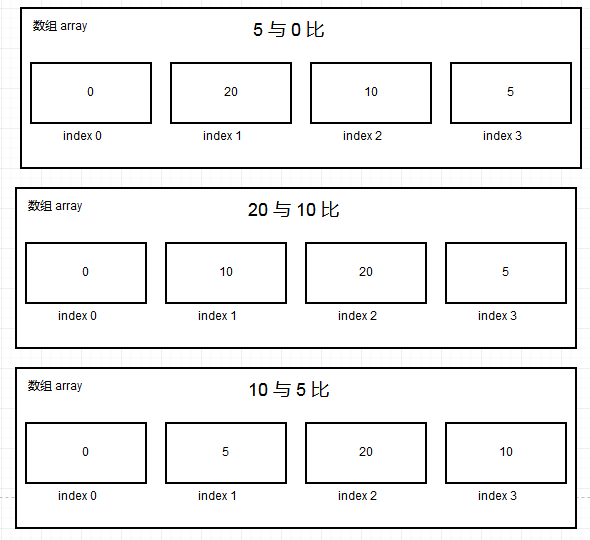
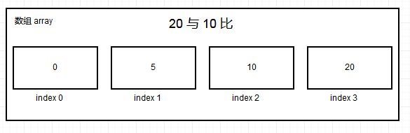
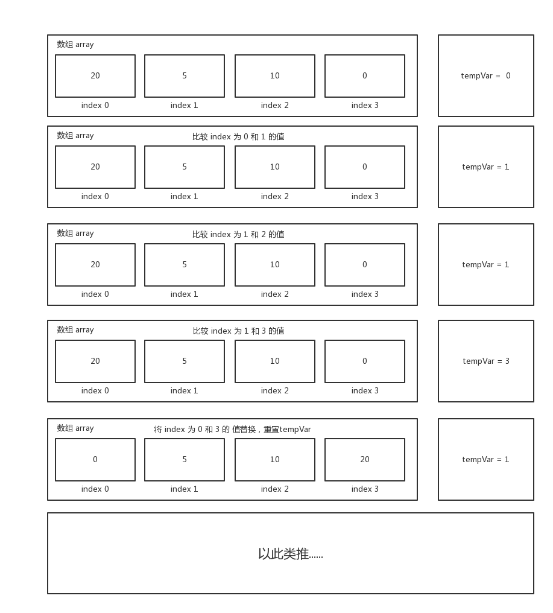
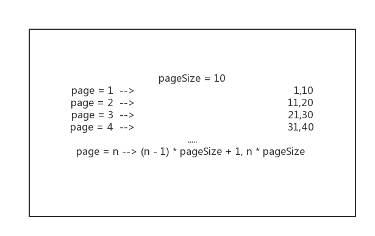

## PHP 系统学习笔记

1. ### php简介
    - #### php执行环境 —— web服务器
        + apache
        + nginx
        + IIS
    - #### php开发的知名产品
        + 论坛: discuz 、 phpwind
        + 商城： shopnc 、 eschop 、 shopex 、 ecore os 、 ecmall
        + 国外： magento 、 zencart 、 opencart
        + 门户： dedecms 、 phpcms
        + 博客： wp(wordpress)
2. ### php安装与简单程序编写
    - #### 环境搭建  
        php 的运行环境是在 web 服务器下的，可以选择安装一些一体化集成环境,一般包括 web服务器、php版本、数据库。  
        + [phpstudy](http://phpstudy.php.cn/)
        + [WampServer](http://www.wampserver.com/)
        + [UPUPW Nginx](http://www.upupw.net/)
        + [XAMPP](https://www.apachefriends.org/index.html)
        + [MAMP Pro for Mac](https://www.mamp.info/en/downloads/)
    - #### 运行php
        环境搭建完成后，输入localhost尽可以访问一个模拟的web服务器。
        默认会进入一个页面，这个页面有 apache 的配置文件所设定。找到 **httpd.conf** 文件，搜索 **document** 可以查看到：如下图  
          
        + php书写方式
            * 常见写法

                ```php
                <?php
                    echo 123;
                ?>
                ```

            *  短标签写法

                ```php
                <?
                    echo 123;
                ?>
                ```
            短标签写法必须在 `php.init` 文件中，把 `short_open_tas` 设为 `on`

            * ASP style
            
            ```php
                <%
                 echo 123;
                 %>
            ```
            ASP style写法必须在 `php.init` 文件中，把 `asp_tags` 设为 `on`

            * 标签插入
                
                ```html
                    <script language="php">
                        echo 123;
                    </script>
                ```
        + php 在 html 里的混编
            
            ```html
            <!DOCTYPE html>
            <html lang="en">
            <head>
                <meta charset="UTF-8">
                <title>Document</title>
            </head>
            <body>
                <span id="span"><?php echo 123;?></span>
                <button id="btn">btn</button>
                <script>
                    var oSpan = document.querySelector("#span");
                    var oBtn = document.querySelector("#btn");

                    oBtn.onclick = function(){
                        oSpan.innerHTML = "hehe";
                    }
                </script>
            </body>
            </html>
            ```
3. ### 整数 & 字符串类型  
    `var_dump($var)` 打印变量同时可以查看变量类型。  
    `print_r($var)` 打印变量，但没有变量类型。
    `unset($var)` 删除 `$var`。
    - #### 整数  
        声明一个整形 : `$a = 10`。可以直接输入其他进制如  

        ```php
            $a = 020; //16
            $b = 0x20; //32
        ```
    - #### 字符串  
        `$str = 'aaa' ` 或者 `$str = "aaa"`；使用单引号或者双引号包含字符串。
        * 单引号里面的变量不会解释
        * 双引号会解释里边的变量

        ```php
            $str = "222";
            echo "hehe$str"; //hehe222
            echo 'hehe$str';//hehe$str
        ```
        * 当在双括号中引入变量时，可能会发生如下情况
        
        ```php
            $str = "hehe";
            echo "$stris not";//这是$stris 会被当成变量，导致警告$stris变量未定义
            echo "{$str}is not";//使用大括号隔离变量与字符串
        ```
        * `{}` 是边界界定符，会解释变量。
        * heredoc语法，一般用于定义多行语法
        ```php

            $str = <<< HEHEDA
                <span>tired</span>
        HEHEDA;//解释，一定要顶格写。并且后面不能接任何内容，包括空格和tag键。
            echo $str;            
        ```
    - #### 布尔型

        ```php
            $a = true;
            var_dump($a);
        ```
    - #### 对象类型 object

        ```php
            class Person{
                private $name = "张三";
                public function getName(){
                    return $this->name;
                }
            }
            $p = new Person();
            var_dump($p);//object(Person)#1(1){ ... }
        ```
    - #### 资源类型(resource)  
        php中常用的资源类型有：控制文件的，链接数据库的等等

        ```php
            $fp = fopen("./file_src","r");
            var_dump($fp); //resource(3) of type (stream)
        ```
    - #### 数组类型
        
        ```php
            $a = array(1,2,3);
            var_dump($a);
        ```
    - #### 浮点型

        ```php
            $a = 2;
            $a = -2;
            $a = 2e2;
        ```
    - #### NULL
        + 变量未设置
        + 变量设置了没有赋值
        + 变量被显性的赋予NULL

        ```php
            $a = null;
            var_dump($a);
        ```
4. ### 变量的变量，变量的引用，常量
    - #### 变量的变量  
    对于变量嵌套变量，会逐层解析。
    ```php
        $h = 'hello';
        $hello = 'hi';
        echo $h; // hello
        echo $$h; //hi
    ```
    - #### 变量的引用  
    变量的引用使用 `&`。 添加引用表示让一个变量指向另一个变量的内容。  
    `@`，看到警告,可是使用该符号来抑制警告。

    ```php
        $a = 10;
        $b = &$a;
        $a = 30;
        echo $a;//30
        echo $b;//30
        unset($a);
        echo $a;//NULL
        echo $b;//30
    ```
    - #### 常量  
        常量使用 `define()` 函数来定义。使用 `defined()` 函数来检测是否定义了某个常量。

        ```php
            define('STR','sleeping');
            echo STR;//sleeping,在define() 函数中有三个参数，第三个参数( case_insensitive )默认为大小写敏感。
        ```
        系统自带常量:
        * `PHP_OS` ——— php运行的服务器版本
        * `PHP_VERSION` ———— php版本
        * `__FILE__` ———— 获取到当前的执行路径
        * `__LINE__` ———— 获取到当前执行代码的行号
        
5. ### 操作符，运算符  
    `isset($var)` 检测变量是否设置，并且不是 `NULL`(就是查看变量是否为`NULL`)。    
    `empty($var)` 检查一个变量是否为空,即隐式转化为布尔值是否为 `FALSE`。  
    `error_reporting()` 设置错误等级。  
    - 算数操作符(+, -, *, /, %, ++, --)
    - 复合操作符(+=, -=, *=, /=, %=, .=)
    - 比较操作符(>, >=, <, <=, ==, ===, !=, !==)
    - 逻辑操作符(&&, ||, !)
    - 位操作符(|, &)(@, ?(3元操作符))
    
6. ### 流程控制
    - #### 分支语句

        ```php
            if($condition){
                //todo ...
            }else if($condition){
                //todo ...
            }else{
                //todo ...
            }

            switch($var){
                case 'a':
                //todo ...
                break;
                case 'b':
                //todo ...
                break;
            }
        ```
    - #### 循环语句

        ```php
            //-for------------------
            $sum = 0;
            for($i = 1;$i <= 100; $i++ ){
                $sum += $i;
            }
            //-do-while-------------------
            $a = 0;
            $ind = 1;
            do{
                $a += $ind;
                $ind ++;
            }while($ind <= 100)

            //-while--------------------
            while($ind <= 100){
                $a += $ind;
                $ind ++;             
            }
        ```
    - `break`和`continue`

7. ### 类型测试函数
    - 检测是否整型  
        `is_int()`, `is_long()`, 'is_integer()'
    - 检测是否浮点数  
        `is_float()`(单精度的浮点数), `is_real()`(is_float的别名), `is_double()`(双精度的浮点数)
    - 检测是否字符串  
        `is_string()`
    - 检测是否数组  
        `is_array()`
    - 检测是否对象  
        `is_object()`
    - 检测是否资源  
        `is_resource()`
    - 检测是否布尔型  
        `is_bool()`  
    - 检测是否 `null`  
        `is_null()`   
    - 检测是否是数值(比如 10, "10")  
        `is_numeric()`  

8. ### 表单提交  
    `header(Location:success.php)` 跳转到 success.php 页面
    - php 如何收集表单所提交的数据？  
        使用超级全局变量, `$_GET`,`$_POST`; `$_REQUEST` 可以同时接受 `$_GET` 和 `$_POST` 所接受到的变量。  
        + `get`方法 `$_GET`

            ```html
                <form action="" method="get">
                    <input type="text" name="user">
                    <input type="submit" value="submit">
                </form>
                <?php
                    echo $_GET['user'];
                ?>
            ```
        + `post`方法 `$_POST`

            ```html
                <form action="" method="post">
                    <input type="text" name="user">
                    <input type="submit" value="submit">
                </form>
                <?php
                    echo $_POST['user'];
                ?>
            ```
        + `post`与`get`的区别
            * post 提交比 get 更加安全，因为 get 提交会在地址栏显示提交内容。
            * post 提交比 get 所能提交的数据更大，在 php.ini 中可以通过 `post_max_size` 可以设置。  
                
            * post 提交会刷新页面。      
            
9. ### 函数定义 & 执行流程
    - #### 函数的定义
        + 语法
            
            ```php
                function fun_name([arg1,arg2...]){
                    //todo...
                }
            ```
        + 例：输入 n 行 n 列表格
            
            ```php
                function outTable($row,$column){
                    echo "<table>";
                    for($i = 0;$i < $row; $i++){
                        echo "<tr>";
                        for($j = 0;$j < $column; $j++){
                            echo "<td> $i - $j </td>";
                        }  
                        echo "</tr>";                  
                    }
                    echo "</table>";
                }
                outTable(3,3);
            ```

        + 特性  
            * 函数中 `return` 后面的语句不会执行
            * 函数被调用完后会返回调用函数的地方
    - #### 函数执行流程   
           
        上图中的 4 个函数 `fn1`, `fn2`, `fn3`, `fn4`   都会被执行到，而且会执行完毕后会返回上一个函数的作用域中。
        
10. ### 变量作用域
    - #### 局部变量作用域  
        - 函数中定义的变量叫局部变量，局部变量，外部是不可以范围的。
        - 局部变量在函数调用完毕后会被释放。
        - 函数外定义的变量，函数是不可以访问的
            
            ```php
                $sum = 0;
                function add($num){
                    $sum += $num;
                    return $sum;
                }
                echo add(5);//报错,Notice: Undefined variable: sum in D:\XAMPP\htdocs\Testtt\New folder\function.php
            ```

    - #### `global` 关键字  
        使用 `global` 关键字来声明变量，可以使得变量称为全局变量。全部变量只有在 **程序运行结束才会被销毁**。

        ```php
            function add($num){
                global $sum;
                $sum += $num;
                return $sum;
            }
            add(5); //5
            add(5); //10
            add(5); //15
        ```

        就算使用 `global` 关键字把一个变量变为全局变量，下一次再另一个函数中使用的时候，还是要使用 `global` 函数进行声明。  

        ```php
            function add($num){
                global $sum;
                $sum += $num;
                return $sum;
            }
            add(5);
            add(5);
            function show(){
                //echo $sum; 
                //错误, Undefined variable: sum in D:\XAMPP\htdocs\Testtt\New folder\function.php
                //使用如下
                global $sum;
                echo $sum;
            }
            show();
        ```
    - #### 静态 ( `static` ) 变量  
        使用 `static` 关键字把变量变成静态变量。其特点
        + 一次初始化( 赋值 )
        + 数据会被共享
        + 变量在函数调用完毕后不会被释放
        
        ```php
            function add($num){
                static $sum;
                $sum += $num;
                return $sum;
            }
            echo add(5);
            echo add(5);
        ```

11. ### 引用传参, 默认参数, 可变参数
    - #### 变量引用传参  
        引用传参传递的是指针，可以改变指针所指向内存里的东西。而值传递传递的是值，会在函数内开辟另外一个内容空间去存储值；之后值得改变就与所传递的变量无关。

        ```php
            $a = 10;
            $b = 11;
            //值传递
            function deliveryValue($n1,$n2){
                $temp = $n1;
                $n1 = $n2;
                $n2 = $temp;
            }
            deliveryValue($a,$b);
            echo $a; //10
            echo $b; //11
            //引用传递
            function deliveryAdress(&$n1,&$n2){
                $temp = $n1;
                $n1 = $n2;
                $n2 = $temp;
            }
            deliveryAdress($a,$b);
            echo $a; //11
            echo $b; //10

        ```
    - #### 函数参数默认值   
        给函数设定默认值,凡是没有默认值得函数必须传参。且传参的顺序与设定的形参的顺序一致；所以默认参数都放后面。

        ```php
            function aa($a, $b, $c= "30", $d=1){
                echo $c;
            }
            aa(2,6,7);
            aa(1,5,3);
        ```
    - #### 可变参数( 参数求和 )  
        `count()` 该函数是计算数组的长度的。  
        在 `javascript` 中有 `arguments` 这个参数表示函数所接受到的参数，是一个数组( `array` )。  
        而 `php` 中也有一个函数起到 `arguments` 的功能: `func_get_args()`;  
        只取一个传入的参数，给该函数传入一个下标: `func_get_arg($position)`;  
        获取到传递给函数参数的个数: `func_num_args()`;  

        ```php
            function add(){
                $args = func_get_args();
                print_r($args);

                $sum = 0;
                $sum1 = 0;
                for( $i = 0; $i < count( $args ); $i++){
                    $sum += $args[$i];
                    $sum1 += func_get_arg($i);
                }
                echo $sum;
                echo $sum1;
            }
            add(10,20,50,30);//array:10,20,50,30


        ```

    - #### 回调函数  
        回调函数就是把函数当做参数传递给另一个函数。

        ```php
            function aa(fn){
                if(fn()){
                    echo 1;
                }else if(fn()){
                    echo 2;
                }
            }

            function isEvent(){
                return floor(random()*100) % 2 === 0;
            }

            $fn = 'isEvent';
            aa($fn);
        ```

    - #### 递归  
        自己调用自己的函数叫做递归。
        
        ```php
            function showNum( $n ){
                echo $n . "\t";
                if($n > 0){
                    showNum($n - 1);
                }else{
                    echo "<------->";
                }
                echo $n . "t";
            }

            showNum(3) // 3 2 1 0 <-------> 0 1 2 3 
        ```
        
        斐波拉切数列: 1, 1, 2, 3, 5, 8, 13, 21, 34, 55, 89, 144 ...

        ```php
            function showFei( $n ){
                if( $n < 2 ){
                    return 1;
                }else{
                    return showFei( $n - 1 ) + showFei( $n - 2 );
                }
            }
            showFei( 1 );
            showFei( 3 );
        ```

        阶乘: n!;  3! = 3 * 2 * 1;
        ```php
            function mul( $n ){
                if( $n == 1){
                    return 1;
                }else{
                    return $n * mul( $n -1 );
                }
            }
            echo mul(3);
        ```

    - #### `require` 和 `include` 和 `require_one` 和 `include_one`   
        `require` 和 `include` 都是引用文件。他们的 **区别**是：当所包含的文件找不到时， `require` 所报的错误是致命错误，同时终止文件执行。 `include` 是报警告，后面代码仍可以执行。  
        **相同点** : 重复包含都会报致命错误。可考虑使用 `require_once`, `include_once`。

    - #### 可替换的流程控制结构  
        ```php
            if($a > 30){
                echo "大于30";
            }else if( $a > 20 ){}
                echo "大于20";
            }else{
                echo "不大于";
            }

            //可替换的流程控制结构
            //if
            if( $a > 30 ):
                echo "大于30";
            elseif( $a > 20):
                echo "大于20";
            else:
                echo "不大于";
            endif;
            //for
            for( $i = 0; $i < 100; $i++):
                echo $i;
            endfor;
            //while
            while( $i < 100):
                echo $i;
                $i++;
            endwhile;
            //switch
            switch (variable) 
                case '20':
                    echo "20";
                    break;               
                default:
                    echo "default";
                    break;
            endswitch;
        ```


12. ### 数组的定义
    - #### 什么是数组   
        数组是内容中一块用来存储数据的连续区域。分为：数组索引、 关联索引。 数组的索引是惟一的。
        + 数组索引
            
            ```php
                //1 
                $arr = array(10,20,30);
                print_r($arr); //Array ( [0] => 10 [1] => 20 [2] => 30 )

                //2
                $arr = array(0 => 10, 1 => 20, 2 => 30);
                print_r($arr); //Array ( [0] => 10 [1] => 20 [2] => 30 )

                //3
                $arr = array(3 => 10, 1 => 20, 2 => 30);
                print_r($arr); //Array ( [3] => 10 [1] => 20 [2] => 30 )

                //4,空索引一定是数组索引，而且判断其索引要看前面最大索引然后再加 1。
                $arr[] = 10;
                $arr[] = 20;
                $arr[] = 30;
                print_r($arr); //Array ( [0] => 10 [1] => 20 [2] => 30 ) 

                //5
                $arr[10] = 10;
                $arr[6] = 20;
                $arr[] = 30;
                print_r($arr); //Array ( [10] => 10 [6] => 20 [11] => 30 ) 

                //读取 与 修改
                $arr = array(10,20,30);
                echo $arr[1]; //20
                $arr[1] = 50;
                echo $arr[1]; //50
            ```

        + 关联索引

            ```php
                //1
                $userInfo = array(
                    "father" => "hehe",
                    "son" => "heihei",
                    "grandFather" => "haha",
                    "grandSon" => "gege",
                );

                //2
                $arr['father'] = 'hehe';
                $arr['son'] = 'heihei';
                $arr['grandFather'] = 'haha';
                $arr['grandSon'] = 'gege';

                //3,关联数组和索引数组可以混写
                $userInfo = array(
                    "hehe",
                    "heihei",
                    "grandFather" => "haha",
                    "grandSon" => "gege",
                );
            ```
    - #### 二维数组
        
        ```php
            //1
            $userInfo = array(
                0 => array(10,20,30),
                1 => array(40,50,60),
                2 => array(70,80,90)
            )

            //读取
            echo $user[0][0]; //10

            //修改
            echo $user[0][0] = 100; //100

            //删除
            unset($userInfo[0][0]);
        ```

13. ### 数组遍历
    - `for` 循环
    - `foreach` 循环( 类似于 `javascript` 的 `for..in..`)  
        `foreach($arr as $key => $value){}` 其中这个 `as` 表示把指针指向 `$arr` 的最开始。
    - `each()` 函数
        `each()` 循环会将该数组按数值索引和关联索引分为 `key` 和 `value` 返回；同时指针下移。当遍历完后，如果不用 `reset` 重置数组指针，则返回 `fasle`。

        ```php
            $arr = array(
                'morning' => '早上',
                'afternoon' => '下午',
                'night' => '晚上'
            );
            $temp = each($arr);
            print_r($temp);//Array ( [1] => 早上 [value] => 早上 [0] => morning [key] => morning ) 

            $temp = each($arr);
            print_r($temp); //Array ( [1] => 下午 [value] => 下午 [0] => afternoon [key] => afternoon ) 
        ```

    - `reset($arr)`
        重置 `$arr` 数组内部的指针的位置。

    ```php
            $arr = array(
                'morning' => '早上',
                'afternoon' => '下午',
                'night' => '晚上'
            );
            $temp = each($arr);
            print_r($temp);//Array ( [1] => 早上 [value] => 早上 [0] => morning [key] => morning ) 
            reset($arr);
            $temp = each($arr);
            print_r($temp); //Array ( [1] => 早上 [value] => 早上 [0] => morning [key] => morning )
    ```

    - `list()`
        接受 `key` 和 `value` 的值，可使用该函数把他们重新拼凑成关联数组

        ```php
            $arr = array(
                'morning' => '早上',
                'afternoon' => '下午',
                'night' => '晚上'
            );
            $temp = each($arr);
            print_r($temp);//Array ( [1] => 早上 [value] => 早上 [0] => morning [key] => morning ) 
            
            unset($temp['key']);//这里是为了说明 list 接收的是 索引为 0 和 1 的值；
            
            list($k , $v) = $temp;
            print_r($k); //morning
            print_r($v); //早上


            //遍历数据
            reset($arr);
            $temp = each($arr);
            list($k , $v) = $temp;
            echo $k . '--->' . $v; //morning--->早上
            $temp = each($arr);
            list($k , $v) = $temp;
            echo $k . '--->' . $v; //afternoon--->下午
            $temp = each($arr);
            list($k , $v) = $temp;
            echo $k . '--->' . $v; //night--->晚上

            //遍历数据
            while(list($k , $v) = each($arr)){
                echo $k . '--->' . $v;
            }
        ```


14. ### 数组常用函数
    - `array_values($arr)`  
        返回数组中所有的值，并且给其重建数字索引( 从 0 开始 )

        ```php
            $arr = array(
                'morning' => '早上',
                'afternoon' => '下午',
                'night' => '晚上'
            );
            print_r($arr); //Array ( [morning] => 早上 [afternoon] => 下午 [night] => 晚上 )
            print_r(array_values($arr)); //Array ( [0] => 早上 [1] => 下午 [2] => 晚上 ) 
        ```

    - `array_keys($arr,[$value,[search_pattern]])`   
        返回数组中所有或者部分的键，并且给其重建数字索引( 从 0 开始 ); 如果传入第二参数 `$value` 只返回 `value = $value` 的键

        ```php
            $arr = array(
                'morning' => '早上',
                'afternoon' => '下午',
                'night' => '晚上'
            );
            print_r($arr); //Array ( [morning] => 早上 [afternoon] => 下午 [night] => 晚上 )
            print_r(array_keys($arr)); //Array ( [0] => morning [1] => afternoon [2] => night ) 
            print_r(array_keys( $arr, '晚上' )); //Array ( [0] => night )
        ```

    - `sort()` , `rsort()` 改变索引, 数字索引数组
        `sort()` 从小到大  
        `sort()` 从大到小

    - `krsort()`根据key排序
    
    - `asort()` , `arsort()` 保留索引,根据value排序   
        `sort()` 从小到大  
        `sort()` 从大到小

        ```php
            $arr = array(10,5,0,9,33,5,4,0,55);
            sort($arr);
            print_r($arr);//Array ( [0] => 0 [1] => 0 [2] => 4 [3] => 5 [4] => 5 [5] => 9 [6] => 10 [7] => 33 [8] => 55 ) 
            rsort($arr);
            print_r($arr);//Array ( [0] => 55 [1] => 33 [2] => 10 [3] => 9 [4] => 5 [5] => 5 [6] => 4 [7] => 0 [8] => 0 ) 
        ```

    - `in_array()`  
        查看某个值是否在数组中,区分大小写，可使用函数 `strtolower()` 转换成小写； 或者 `strtoupper()` 转换成大写。   

        ```php
            $arr = array('jpg', 'png', 'jpeg', 'gif');
            $fileName = 'test.jpg';
            list($name, $ext) = explode('.', $fileName);// $name = test, $ext = jpg
            if(in_array($ext, $fileName)){
                echo 'ok';
            }
        ```

    - `array_reverse()`   
        将数组反转  

        ```php
            $arr = array(10,50,30);
            print_r(array_reverse( $arr ));//Array ( [0] => 30 [1] => 50 [2] => 10 ) 
        ```
        
    - `count($arr,[$all_lenght])`   
        返回数组长度

        ```php
            $arr = array(
                10 => array( 2,5,8 ),
                20 => array( 2,5,8 ),
                30 => array( 2,5,8 )
            );
            print_r(count( $arr )); //3
            print_r(count( $arr, true )); //12,包括了一位数组的项数和一维数组里的数组的项数。
        ```
        
    - `array_count_values()`   
        统计值重复出现的次数
        
        ```php
            $arr = array(10,20,10,10,30,30,50,10,90);
            print_r(array_count_values($arr));//Array ( [10] => 4 [20] => 1 [30] => 2 [50] => 1 [90] => 1 )  10出现4次，20出现1次....


            //一个与之功能一样的自己写的函数
            $newArr = array();
            foreach( $arr as $k => $v){
                if(!isset( $newArr[$v] )){
                    $newArr[$v] = 1;
                }else{
                    $newArr[$v]++ ;
                }
            }
        ```
    - `range($start, $end,[number $step = 1 ])`   
    生成一段范围的数值,类似于 `for` 循环  
        
        ```php
            print_r(range(1,20));//Array ( [0] => 1 [1] => 2 [2] => 3 [3] => 4 [4] => 5 [5] => 6 [6] => 7 [7] => 8 [8] => 9 [9] => 10 [10] => 11 [11] => 12 [12] => 13 [13] => 14 [14] => 15 [15] => 16 [16] => 17 [17] => 18 [18] => 19 [19] => 20 ) 
        ```

    - `array_unique()`   
        数组去重复  

        ```php
            $arr = array(10,20,10,10,30,30,50,10,90);
            print_r(array_unique($arr)); //Array ( [0] => 10 [1] => 20 [4] => 30 [6] => 50 [8] => 90 ) 
        ```
        
    - `array_filter( array $array [, callable $callback [, int $flag = 0 ]])`  
        数组过滤  
        ```php
        $entry = array(
             0 => 'foo',
             1 => false,
             2 => -1,
             3 => null,
             4 => ''
          );

        print_r(array_filter($entry));//Array ( [0] => foo [2] => -1 ) 


        // 传入function
        function odd($var){
            // returns whether the input integer is odd
            return($var & 1);
        }
        function even($var){
            // returns whether the input integer is even
            return(!($var & 1));
        }
        $array1 = array("a"=>1, "b"=>2, "c"=>3, "d"=>4, "e"=>5);
        $array2 = array(6, 7, 8, 9, 10, 11, 12);

        echo "Odd :\n";
        print_r(array_filter($array1, "odd"));// Array ( [a] => 1 [c] => 3 [e] => 5 ) 
        echo "Even:\n";
        print_r(array_filter($array2, "even"));//Array ( [0] => 6 [2] => 8 [4] => 10 [6] => 12 ) 


        ```
        
    - `array_walk()`   
        使用用户自定义函数对数组中的每个元素做回调处理，返回 `bool`

        ```php
            $arr =array("hehe"=>"xiao","wawa"=>"ku");
            function show($v, $k){
                echo $v . "---->" . $k;
            }            
            array_walk($arr,"show");//xiao---->heheku---->wawa
        ```
        
    - `array_slice()`  
        
        ```php
        ```
        
    - `array_merge()`  
        合并两个数组

        ```php
            $arr1 = array( 10,20,30 );
            $arr2 = array( 30,50,60 );
            //重复的值不会产生覆盖
            $arr3 = array_merge($arr1, $arr2);
            print_r( $arr1 ); //Array ( [0] => 10 [1] => 20 [2] => 30 )
            print_r( $arr2 ); //Array ( [0] => 40 [1] => 50 [2] => 60 ) 
            print_r( $arr3 ); //Array ( [0] => 10 [1] => 20 [2] => 30 [3] => 30 [4] => 50 [5] => 60 ) 
        ```
        
    - `array_push()`  
        压栈( 最后一项 )
        
    - `array_pop()`  
        出栈( 最后一项 )
        
    - `array_shift()`  
        出栈( 最前一项 )
        
    - `array_unshift()`  
        压栈( 最前一项 )

    - `array_rand($arr , $n)`  
        从一个数组中随机 n 数出来。

        ```php
            $array = array(10,2,030,5855,9,63,25,45,2);
            $newArr = array_rand($array , 3); //Array ( [0] => 2 [1] => 3 [2] => 7 ) ,Array ( [0] => 1 [1] => 5 [2] => 6 ) ,....
        ```

    - `shuffle()`  
        打乱一个数组

        ```php
           $arr = array( 10,20,30 );
           print_r($arr); //Array ( [0] => 10 [1] => 20 [2] => 30 )
           shuffle($arr); 
           print_r($arr); //Array ( [0] => 10 [1] => 30 [2] => 20 ) 
        ```

    - `array_sum()`  
        数组求和       

15. ### 练习
    - [表单输出素数](practice/FormOutPutPrime.php)
    - [冒泡算法](practice/BubbleAlgorithm.php)
        + 原理  
          
          
          
        + 特点  
            每一次比较都会调换数组里的值。
    - [选择算法](practice/SelectionAlgorithm.php)
        + 原理  
          
        + 特点   
           确定为最小(大)值才调换数组里的值。
        + 与冒泡算法比较  
            由于不是每次比较都交换数组里面的值，其性能会比冒泡算法好。但是开辟了另外一块内存来存储变量。所以内存的暂用会比冒泡算法多。
    - [分页原理](practice/Pagination.php)  
         从 url 中显示的 页码page, 选取从 page 后的 n(pagesize)条数据。  
         

16. ### [三维数组的遍历](practice/traverseThreeDimenArr.php)
    
17. ### [列表查看方式](practice/Pagination.php)

18. ### 字符串函数
    - `print`
        打印字符串
    - `echo`
        打印字符串
    - `die`
        终止运行
    - `exit`
        终止运行
    - `trim`
        删除两端的空格 
    - `rtrim`,`ltrim`
        删除左边或者右边的空格
    - `str_pad`
        + 使用另一个字符串填充字符串为指定长度
        + 语法 `string str_pad(string $input,int $pad_length[,string $pad_string = "" [,int $pad_type = STR_PAD_RIGHT]])`
        + 示例
            ```php
                $string = 11111;
                echo str_pad($string, 7, "a"); //11111aa
                echo str_pad($string, 7, "a", STR_PAD_LEFT); //aa11111
            ```
    - `str_repeat()`
       填充字符串
    - `strtolower`
        转化成小写
    - `strtoupper`
        转化成大写
    - `ucfirst`
        首字母大写
    - `ucwords`
        每个单词首字母大写
    - `htmlspecialchars`
        不解释 html 标签(实体)，并且在页面中显示该标签 
    - `strip_tags`
        不解释 html 标签(实体)，并且不在页面中显示该标签 
    - `strrev`
        反转字符串
    - `md5`
        加密方法, 加密的字符串是唯一的，且不可逆。
    - `explode`
        切割字符串
    - `implode`
        合并数组
    - `strstr`
        查找字符串的首次出现，返回该字符串以后的所有字符串，查到即停止。
    - `strpos`
        查找字符串的首次出现，返回索引，查到即停止,从前往后找。
    - `strrpos`
        查找字符串的首次出现，返回索引，查到即停止,从后往前找。
    - `substr`
        截取字符串
    - `str_replace`
        替换字符串
    - `chr`
        Acsii 码转字符
    - `ord`
        字符转 Acsii 码

19. ### 正则表达式
    -  `preg_match`     
        + 执行一个正则表达式匹配,搜索 `subject` 与 `pattern` 给定的正则表达式的一个匹配。匹配到即返回。    
        + 参数: `string $pattern,string $subject [, array &$array [, int $flags = 0 [, int $offset = 0]]]`

    - `preg_match_all`  
        与上面的 `preg_match` 一样，但是是全局匹配。

    - `preg_replace`  
        + 执行一个正则表达式的搜索和替换  
        + 参数: `mixed $pattern , mixed $replacement , mixed $subject [, int $limit = -1 [, int &$count ]]`   
        + 例子:   
        ```php
            $string = 'April 15, 2018';
            $pattern = "(\w+) (\d+), (\d+)/i";
            $replace = "${1}1,$3";
            echo preg_replace($pattern,$replace,$string); //April1,2018


            $date = "Jan 1 2015";
            $pattern2 = '(\w+) (\d+) (\d+)';
            echo preg_replace($pattern,'\\1 \2 2016',$date); // Jan 1 2016
        ```

    - `preg_replace_callback`
        + 执行一个正则表达式，并且使用一个回调进行替换
        + 参数: ` mixed $pattern , callable $callback , mixed $subject [, int $limit = -1 [, int &$count ]]`
        + 练习: 
            * 敏感词过滤 ( `/^[\x{4e00}-\x{9fa5}]+$/u` )
                - 上述 `pattern` 中， `\x` 代表 十六进制， `u` 表示模式字符串被认为是 `utf-8` 编码的。
                
                ```php
                    $string = "hehehnimadeddd,a nimade,haha hahahahha,nimade";

                    $pattern = "/nimade/";
                    $line = preg_replace_callback(
                        $pattern,
                        function( $one ){
                            $str = "";
                            for($i = 0;$i < strlen($one[0]); $i++){             
                                $str .= "*";
                            }
                            return $str;
                        },
                        $string
                    );
                    echo $line; //heheh******ddd,a ******,haha hahahahha,******


                    $string = "你好";
                    var_dump(preg_match("/[\x{4e00}-\x{9fa5}]/u",$string,$match));
                    print_r($match); //Array ( [0] => 你 ) 
                ```

            * 标签过滤
                - 关键在于遏制贪婪,遏制贪婪可以使用修正符 `U`,或者在遏制的地方加上 `?`
                ```php
                    $string = "<b>ha\<hha</b><b>hehehe</b>";
                    $pattern = "/<[^>]+>(.+?)<\/[^>]+>/";
                    //或者$pattern = "/<[^>]+>(.+)<\/[^>]+>/U";
                    preg_match($pattern,$string,$match);
                    print_r($match[1]);//ha\<hha
                ```
    - 预搜索:预搜索是一个非获取匹配，不进行存储供以后使用。
        + 正向:   
          `(?=xxxxx)`:所在缝隙的右侧，必须能够匹配上 `xxxxx` 这部分的表达式;  
          `(?!xxxxx)`:所在缝隙的右侧，必须不能匹配 `xxxxx` 这部分表达式  
        + 反向:   
          `(?<=xxxxx)`:所在缝隙的 "左侧”能够匹配xxxxx部分;  
          `(?<!xxxxx)`:所在缝隙的“左侧”不能匹配xxxx部分。  


          ```php
            $str = 'windows NT windows 2003 windows xp';
            $pattern = "/windows (?=xp)/";
            preg_match_all($pattern,$str,$match);
            print_r($match);
            //Array ( [0] => Array ( [0] => windows(windows xp中的windows) ) )
             
            $str = 'windows NT windows 2003 windows xp';
            $pattern = "/windows (?!xp)/";
            preg_match_all($pattern,$str,$match);
            print_r($match);
            //Array ( [0] => Array ( [0] => windows(windows NT中的windows) [1] => windows(windows 2003中的windows) ) ) 
            
            $str = 'windows NT windows 2003 windows xp';
            $pattern = "/windows (?<=xp)/";
            preg_match_all($pattern,$str,$match);
            print_r($match);
            //Array ( [0] => Array ( ) ) 
            
            $str = 'windows NT windows 2003 windows xp';
            $pattern = "/windows (?<!xp)/";
            preg_match_all($pattern,$str,$match);
            print_r($match);
            //Array ( [0] => Array ( [0] => windows(windows NT中的windows) [1] => windows(windows 2003中的windows) [2] => windows(windows xp中的windows) ) ) 
            
            //进行存储
            $str = 'windows NT windows 2003 windows xp';
            preg_match_all('/windows ([^xp])/',$str,$res);
            print_r($res);
            //Array ( 
                //[0] => Array ( 
                    //[0] => windows N 
                    //[1] => windows 2 
                //) 
                //[1] => Array ( 子模式所匹配的字符串组成的数组，通过存储取得。
                    //[0] => N 
                    //[1] => 2 
                //) 
            //) 
          ```
    - `\b` 边界 `\B` 非边界
    - `\s` 空格 `\S` 非空格
        + 练习 
            * 去除两边的空格
            ```php
            $str = "         kaddsdkfj  kdsfjalk    ";
            echo $str;
            echo "\r\n";
            $pattern = "/^\s*|\s*$/";
            // $pattern = "/\s*\b/";  去除所有的空格
            $line = preg_replace($pattern,"",$str);
            echo $line;
            ```
    - `preg_split`  
        通过一个正则表达式分隔字符串  
        + 参数 `string $pattern , string $subject [, int $limit = -1 [, int $flags = 0 ]] `
        + 例子  

        ```php
            //使用逗号或空格(包含" ", \r, \t, \n, \f)分隔短语
            $keywords = preg_split("/[\s,]+/", "hypertext language, programming");
            print_r($keywords);           
        ```
        
    - 量词
        +  `{n}` 刚好 n 次
            ```php
                $string = "abc";
                $pattern = "/a{0}bc/";
                preg_match($pattern,$string,$matches);
                print_r($matches); //bc
            ```
        +  `{n,}` 至少 n 次
        +  `{n,m}` n 到 m 次
        +  `*` 0 次或者多次
        +  `+` 1 次或者多次
        +  `?` 0 次或者 1 次
    
    - 练习
        + 劈开 `php pro,hehe`;
            ```php
                $str = "php pro,hehe,dd";
                $pattern = "/\s|,+/";
                $keyword = preg_split($pattern, $str);
                print_r($keyword); //Array ( [0] => php [1] => pro [2] => hehe [3] => dd ) 
            ```
        + 统计字符出现最多的那个字符的次数和字符
            ```php
                $str = "fadsewfewfnkenkfenkeeeeeeeeeeeeeeeeeeeeeeese";
                $strArr =preg_split("//",$str);
                $counts =array_count_values($strArr);
                arsort($counts);
                list($k,$v) = each($counts);
                echo $k . '---' . $v;
            ```

20. ### mysql数据库入门
    - SQL(struct query language)：结构化查询语言
        + 关系型数据库
            * mysql: 企业版，集群版，社区版
            * oracle
            * sqlServer
    - NO-SQL( Not Only SQL )
        + 非关系数据库
            * redis
            * mongoDB
    - CS 类型软件( Client - Server )  
        应用软件到服务器，版本更新的话，两者都要更新。
    - BS 类型软件( Broswer - Server)  
        浏览器到服务器，版本更新的话，只需要更新服务器即可。
    - 图形化界面工具
        + [HeidiSQL](https://www.heidisql.com/) 免费
        + [SQLyou](https://www.webyog.com/)
    - 数据库引擎
        + MyISAN: 不支持事务，相对 Innodb 没有那么安全，数据相对 Innodb 小，支持全文索引。
        + Innodb: 支持事务，更安全，数据大，不支持全文索引，支持外键。
            * 外键: 如果一条记录有外键，必须先解除外键，才可以删除。
    - 简单的SQL语句
        + `SELECT * FROM user WHERE username LIKE '%z%'`  
            其中的 `%` 是占位符。 
    - php中操作mysql
        + 链接
            * `mysql_connect( "localhost(主机名)","root(用户名)","***(密码)" )`  
                正确链接返回一个资源句柄 `Resource id #3`, 错误链接可以使用 `mysql_error()` 获取错误信息。 
        + 选择数据库
            * `mysql_select_db("db_name")` 
        + 设置编码
            * `mysql_query( "set names utf8" )`
        + 操作 
            * 查询
                - 使用 `SELECT` 关键字:  
                    `SELECT select_column FROM db_name WHERE condition = condition LIMIT 1 ORDER BY ASE`;
                - 返回一个资源句柄 `Resource id #4`，还需对其进行操作才能获取到数据
                - 操作查询所返回的资源句柄
                    + `mysql_fetch_assoc( $resource )` --> key,value
                    + `mysql_fetch_row( $resource )` --> index,value
                    + `mysql_fetch_array( $resource )` --> key,index,value
                    + `mysql_fetch_object( $resource )` --> 返回的数据格式是 std OBJECT
            * 插入
                - 使用 `INSERT INTO` 关键字:   
                    `INSERT INTO db_name ( feild1, feild2 ) VALUES ( value1, value2 )`;
                - 返回一个布尔值
            * 删除
                - 使用 `DELETE` 关键字:  
                    `DELETE FROM db_name WHERE condition = 1 LIMIT 1`;
                - 返回一个布尔值
            * 修改
                - 使用 `UPDATE` 关键字:  
                    `UPDATE db_name SET feild1 = value1, feild2 = value2 WHERE condition = 1`;
                - 返回一个布尔值
            * 执行( 增删改查 )
                - `mysql_query( $sql )`;
        + 关闭数据库
            `mysql_close()`

21. ### 在插入操作中会出现的错误
    - 插入有特殊字符导致 sql 语句错误 
        + 引号
            可能导致 sql 语句错误，如插入 `hehe'haha'` 导致 sql 语句变成
            `$sql = INSERT INTO db_name (feild) VALUES ('hehe'haha'');`   
            解决: 转义引号( `\'` ),或者使用 html( `&#039;` 使用函数 `htmlspecialchars()` ) 实体。
22. ### 数据库备份
    - 在windows下，数据库的内容都是保存在 MySql 文件夹的 data 下面。把其中保存数据的文件夹拷贝一份就是数据库了。
    - 使用图形工具对数据内容导出进行备份。
    
23. ### php中的面向对象
    - 语法
        ```php
            //声明类
            class Person{
                public $name = "zhang";
                public function say(){
                    return "hi";
                }
            }

            //示例化对象
            $p = new Person();
            echo $p->name;
        ```
    - 构造函数( 实例化对象自动调用 )
        + `public function __construct`
        + `public function className`
    - 析构函数( 实例化对象被系统回收或者程序执行完毕自动调用,对象没有被引用了 )
        + `public function __destruct`
    - 属性
    - 方法

24. ### mysql 操作类的封装
    ```php
        class mySql
        {
            private $_host;
            private $_root;
            private $_pwd;
            public function __construct($_host,$_root,$_pwd,$dbname){
                $this->_host = $_host;
                $this->_root = $_root;
                $this->_pwd = $_pwd;
                if($this->connect()){
                    $this->select_db($dbname);
                    mysql_query("set names utf-8");
                }else{
                    echo "connect error ".mysql_error();
                };
            }

            private function connect(){
                return mysql_connect($this->_host,$this->_root,$this->_pwd);
            }

            public function select_db($_dbname){
                mysql_select_db($_dbname);
            }

            public function select($_sql){
                $res = $this->query($_sql);
                $arr = [];
                while($one = mysql_fetch_assoc($res)){
                    $arr[] = $one;
                }
                return $arr;
            }

            public function add($arr,$tablename){
                $sql = "INSERT INTO $tablename ";
                $sql .= "(". implode( "," , array_keys( $arr ) );
                $sql .= ") VALUES ('".implode( "','" ,array_values( $arr ) )."')";
                return mysql_query($sql);
            }

            public function getCount($_tablename){
                $res = $this->query("SELECT COUNT(*) FROM $_tablename");
                return mysql_fetch_row($res)[0];
            }

            public function query($sql){
                return mysql_query($sql);
            }

        }
    ```


25. ### 面向对象的继承
    - 关键字 `extends`
    - 私有属性( `private` )的继承
        不能被继承，私有属性只能在本类的内部访问。
    - 保护属性( `protected` )的继承
        可以被继承,只能在本类或者类的子类的内部访问。
    - 公有属性( `public` )的继承
        可以被继承,可以在类的外部访问。
    - 构造函数( `__construct` )的继承
        构造函数可以被覆盖。当覆盖后可以使用 `parent::__construct()` 调用父类的构造函数。
    - 继承的规则
        + 声明与继承来的属性或者方法一样的标识符，原本标识符的方法或者属性就会被重写(在子类中)。
        + 继承而来的属性或者方法不可以缩小其权限，即如果父类是使用 `pulic`声明的该方法或者属性，子类不可以使用 `private` 或者 `protected` 来重新声明该方法或者属性。但权限是可以放大的可以放大。


26. ### 面向对象的多态
    - 对象传参
        ```php
            class Person
            {
                public function go($instance){
                    $instance->run();
                }
            }

            class Teacher
            {
                public function run(){
                    echo "Teacher run";
                }
            }

            class Student
            {
                public function run(){
                    echo "Student run";
                }
            }

            $p = new Person();
            $t = new Teacher();
            $s = new Student();

            $p->go($t);//Teacher run
            $p->go($s);//Student run
        ```
    - 对象传参并且限定参数类型
        ```php
            class Person
            {
                public function go(Student $instance){
                    $instance->run();
                }
            }

            class Teacher
            {
                public function run(){
                    echo "Teacher run";
                }
            }

            class Student
            {
                public function run(){
                    echo "Student run";
                }
            }

            $p = new Person();
            $t = new Teacher();
            $s = new Student();

            $p->go($t);//Catchable fatal error: Argument 1 passed to Person::go() must be an instance of Student,
            $p->go($s);
        ```
    - 多态
        + 父类定义一个方法不是现实，具体由子类来实现。所以多态是建立在继承的基础上。
        + 参数传递传递的是父类的实例
        ```php
            class Medi
            {
                public function go(Person $person){
                    $person->go();
                }
            }
            class Person
            {
                public function run(){};
            }

            class Teacher extends Person
            {
                public function run(){
                    echo "Teacher run";
                }
            }

            class Student extends Person
            {
                public function run(){
                    echo "Student run";
                }
            }

            $m = new Medi();
            $t = new Teacher();
            $s = new Student();

            $m->go($t);//Teacher run
            $m->go($s);//Student run
        ```
    
27. ### 面向对象的静态属性  
    - 类申明完毕之后，静态属性就存在，并且可以通过类直接调用。
    - 静态属性在内存中只有一块
    - 类调用静态方法 **可以**
    - 类调用动态方法 **不可以**( 当方法里面有变量 `$this` )
    - 对象调用静态方法 **可以**
    - 对象调用动态方法 **可以**
    - 对象调用静态属性 **不可以**
    - 方法和属性的区别在于，方法不管是动态方法还是静态方法，在类中都是一份。而属性则不同，是属于对象自己的。但是静态属性只有一份，静态属性只有靠类本身去调用，实例并不可以调用。
    ```php
        class Test
        {
            public static t = 1;
            public tt = 22;
            public static function ft(){
                echo "static function <br/>";
            }
            public function ftt(){
                echo $this->tt .  "dynastic function <br/>";
            }
        }

        $t = new Test();
        $t->ft();//static function
        $t->ftt();//dynastic function
        echo $t->tt . "<br/>";//22
        echo $t->t . "<br/>";//Notice: Undefined property: Test::$t,不可以用对象访问静态属性

        Test::ft();//static function
        Test::ftt();//Fatal error: Using $this when not in object context in
        echo Test::$tt . "<br/>";// Access to undeclared static property: Test::$tt 
        echo Test::$t . "<br/>";//1

    ```


28. ### 魔术方法
    - `__get`
        + 当在类的外部访问类的属性的时候，会判断是否有权限访问该属性，如有则输出，没有则调用 `__get` 方法(如果访问的属性不存在也会调用该方法)。
        ```php
            class Test
            {
                public $t = 1;
                protected $tt = 2;
                private $ttt = 3;

                public function __get($k){
                    echo "get" . $this->$k;
                }
            }
            $t = new Test();
            echo $t->t . "<br/>";//1 没有调用__get
            echo $t->tt . "<br/>";//get2
            echo $t->ttt . "<br/>";//get3
        ```
    - `__set`
        + 当在类的外部修改类的属性的时候，会判断是否有权限访问该属性，如有则修改，没有则调用 `__get` 方法(如果访问的属性不存在也会调用该方法)。
        ```php
            class Test
            {
                public $t = 1;
                protected $tt = 2;
                private $ttt = 3;

                public function __set($k,$v){
                    echo $this->$k . $v. "<br/>";
                }
            }
            $t = new Test();
            $t->t;//没有调用__set
            $t->tt = 2;//22
            $t->ttt = 1;//31
        ```


29. ### 文件上传
    - 超级全局变量 `__FILES__`
        用来接收文件上传信息的, 上传文件在表单中一定要添加 `enctype` 属性, 并将值设为 `multipart/form-data`, 其意思为表单提交的内容包括了多媒体信息。
        `__FILES__` 详情可以查看手册，比如错误代码等。
    - 判断一系列条件，如果通过，使用 `move_uploaded_file` 函数把临时文件转移到指定目录即可。
    - `is_dir` 判断是否是目录
    - `mkdir` 创建目录，给与权限。
   

30. ### 编辑器插件  
    [kindeditor](http://kindeditor.net/demo.php)  
    htmlspecialchars_decode() 将 html 实体转化为 html 标签；
    strip_tags() 去除 HTML 和 PHP 标记

31. ### 内容跨表
    - `LEFT JOIN` 以左表为基准，按照左表的记录一条一条去所关联的表中找到扩展的数据
    - `RIGHT JOIN` 以右表为基准，按照左表的记录一条一条去所关联的表中找到扩展的数据
    - `INNER LEFT JOIN` 在 `LEFT JOIN` 的结果上，去掉扩展查找为空的记录。
    - 比较正规的 SQL 语句写法
        ```sql
            SELECT 
                * 
            FROM 
                table 
            LEFT JOIN 
                anothertable 
            ON  
                table.`id` = anothertable.`t_id` 
        ```
32. ### 时间函数 
    - `time()`  
        获取当前时间。返回从1970年到现在的秒数。
    - `date([date-format])`
    - `strtotime()`
    - `mktime()`
    - `date_default_timezone_set()`
    - `cookie`与`session`
      `cookie`类似于会员卡，`session`类似于用手机号注册的会员。`cookie`需要随身携带，而session则是存在于服务器中的。 其主要作用就是用于表示用户的。用于记录登录客户在整个网站的行为。
      + `cookie`
        在php中 `cookie` 存储在超级全局变量 `$_COOKIE`中。  
        * 设置: `setcookie("key","value"[,dead_line])`
        * 设置过期: value设置为空，设置过期时间。
      + `session`
          * session是一种服务器端的会话技术
          * 要是用session必须先开启session `session_start()`。 `session_start`开启时会做几件事：
              - 生成一条`cookie`记录,`key`为`PHPSESSID`,值为一个随机乱码。
              - 在服务器的php文件夹的tmp文件夹中，生成一个sess开头的文件。初始化状态下该文件为空。
          * 设置 `SESSION`: `$_SESSION[key] = value`,该值被记录在了上面的 sess 文件夹中。该文件可以在`php.ini`中配置。 SESSION默认使用记录标识的方式是 COOKIE 方式，如果 COOKIE 被禁用，则使用 GET 方式记录。
          * `session_name`, `session_id()` 购物车就是使用 session_id 做的。该值是 `session_start()` 后生成的值，是唯一的。 
          * 删除 SESSION 使用`unset()`
          * `session_destroy()`

33. ### ajax基础&原理
    - 请求状态码
        + 200 请求成功
        + 301 永久重定向
        + 302 临时重定向
        + 404 找不到页面
        + 403 服务器接收到请求但拒绝服务
        + 500 服务器发生错误
        + 503 服务器发生错误，暂时不可以服务
    - ajax过程
        + open 方法  
        + send 方法
        + 事件 `onreadystatechange`
        + 请求状态 readyState
            * 1: open状态
            * 2: send状态
            * 3: 正在接受到资源但还没有完成
            * 4 / `'complete` 完成
        + 设置请求头方法 `setRequestHeader`
            * 使用 `post` 方法的时候添加请求头 `application/x-www-form-urlencoded`
34. ### GD库函数
    - 使用之前要开启 php_gd2，也就是在 php.ini 中把 `extension=php_gd2.dll` 前面的注释去掉
    - GD 库函数是图片处理函数
    - 画图步骤
        + 创建画布  
            * `imagecreatetruecolor( $width, $height)`
            * `imagecreatefrompng( resource $img)`
            * `imagecreatefromjpeg( resource $img )`
        + 做图
            * 选择颜色 `imagecolorallocate( $img, red, blue, yellow )`
            * 填充画布 
                `imagefilledrectangle( $img, $top, $left, $width, $height, $color )`  
                `imagefilledpolygon( $img, array $point, int $num_point, $color )`  
                `imagefilledarc( $img, $cx, $cy, $width, $height, $start, $end, $color, $style )`
            * 画点 `imagesetpixel( $img, $x, $y, $color )` 
            * 划线 `imageline( $img, $x_start, $y_start, $x, $y, $color )`
            * 画矩形 `imagerectangle( $img, $x_start, $y_start, $x, $y, $color)`
            * 画多边形 `imagepolygon( $img, array $point, int $num_point, $color )`
            * 画圆 `image( $img, $circle_x, $circle_y, $width, $height, $color )`
            * 画圆弧 `imagearc( $img, $cx, $cy, $width, $height, $start, $end, $color )` `$start` 和 `$end` 是度数 0 - 360
            * 输出文字 `imagestring( $img, $fontsize, $show_x, $show_y, $string, $color )` 比较鸡肋，不可以输出中文，而且fonesize最大为5
            * 输出文字 `imagettftext( $img, $fontsize, $angle, $show_x, $show_y, $color, $fontfile, $string )`
        + 渲染画布
            * `header( "Content-type:image/png")`
        + 输出画布
            * `imagepng( Img $img )`
        + 销毁画布
            * `imagedestroy( Img $img )`

35. ### 图片缩放、裁剪加水印
    - 重采样，拷贝部分图片并调整大小 
    ```
        imagecopyresampled( 
            resource $dst_image, resource $src_image, 
            int dst_x, int dst_y, 
            int src_x, int src_y, 
            int dst_width, int dst_height, 
            int src_width, int src_height
        )
    ```
    src表示原图
    - 获取图片信息 `getimagesize( resouce $image )`, 返回一个具有四个单元的数组:
        + [0] => width
        + [1] => height
        + [2] => image type( 1:git, 2:jpg ... )
        + [3] => text string ( width = "xxx", height = "xxx")
        + [4] => 图像的通道颜色( 多少位 )
        + [5] => 多少个通道
        + [6] => mime
    - 保存图像 `imagejpeg( resource $image [, string $filename [, int $quality]])`, `imagepng`
    - 水印 —— 拷贝图像 `imagecopy( resouce $dst_im, resouce $src_im, int $dst_x, int $dst_y, int $src_x, int $src_y, int $src_w,  int $src_h)` 

36. ### 模板引擎
    - 常见的有 smarty, twig 等等
    - [smarty](https://www.smarty.net/docs/zh_CN/) 使用准备
        + 建立文件夹
            * 建立编译文件目录(`cache`,可自定义命名)
            * 建立缓存文件目录(`compile`,可自定义命名)
            * 建立模板文件目录(`template`,可自定义命名)
        + 在smarty中配置
            * 引入 `./smarty/Smarty.class.php` 文件
            * 实例化一个smarty对象
            * 通过 `print_r` 打印这个对象可知在对象有 `cache_dir`,`compile_dir`,`template_dir`等属性，改变该属性的值，就可以配置目录了
        + 使用 `assign('var',$var )` 方法注册对象
        + 使用 `display()` 方法渲染页面
        + 使用 `{ $var }` 来在模板中使用已经注册的变量
        + 循环 `{foreach $var as $k => $v}{/foreach}`
        + 流程控制 `{if $var gt 10}{else}{/if}`
        + 保留变量
            * get: `{$smart.get.varialname}`
            * session: `{$smart.session.varialname}`

37. ### 无限极分类
    - 使用递归的方法来实现
    - 在使用递归的过程中有三种方法可以保存变量
        + 使用静态变量

            ```php
                function num($num){
                    static $arr = array();
                    $arr[] = $num;
                    if( $num < 10 ){
                        num($num);
                    }
                }
            ```

        + 使用全局变量
            ```php
                $arr = array();
                function num($num){
                    global $arr;
                    $arr[] = $num;
                    if( $num < 10 ){
                        num($num);
                    }
                }
            ```
        + 传递引用
            ```php
                function num($num, &$arr){
                    $arr[] = $num;
                    if( $num < 10 ){
                        num($num,&$arr);
                    }
                }
            ```


38. ### 命名空间
    例  
    ```php
        //fu.php
        namespace groupone
        class Page
        {
            pulic function ee(){
                echo "ee";
            }
        } 

        namespace grouptwo
        class Page
        {
            public function ee(){
                echo "ee33";
            }
        }
        //由于有namespace，所以不会报错 redeclare 
        
        //index.php
        //使用命名空间里的类
        //包含
        require("fu.php");
        //使用命名空间
        use groupone\Page;
        $p = new Page();
        $p->ee();
    ```

39. ### [thinkPHP](http://www.thinkphp.cn/)
    - [github](https://github.com/top-think/think)
    - 目录结构 (3.2.xx)
        + application 开发网站的目录
        + Public 存放静态资源文件( 如CSS,JS )
        + ThinkPHP
            * Common/functions.php 公共函数库
            * Conf 包含配置文件
            * Lang 语言包文件
            * Library 库，核心的代码都在这里面，里面存放着各种类
                - Behavior 行为类
                - Org 第三方的工具类
                - Think ThinkPHP这个框架的核心类
            * Mode 应用模式

40. ### Thinkphp控制器访问原理
    - 在一个新的 Thinkphp 框架的 Application 中有如下文件
        + index.html
        + README.md
    - localhost中访问该文件会在 Application 中自动创建如下文件(thinkphp3.2.x)，同时自动访问 `HOME/Controller/IndexController.class.php` 文件的 `index` 方法，该路径可以在配置文件 `.\ThinkPHP\Conf\convention.php` 中修改。
        + Common 这个是一个公共的配置文件
            * Common *一般放置公共函数*
                - index.html
            * Conf *一般放置公共配置*
                - config.php
                - index.html
            * index.html
        + Home *这个目录叫模块*
            * Common *这个Common跟上面的Common功能一样， 也是放置公共函数的， 但是优先级不同*
            * Conf *这个Conf跟上面的Conf功能一样， 也是放置公共配置的， 但是优先级不同*
            * Controller *控制器*
            * Model *模型*
            * View *视图*
            * index.html
        + Runtime
        + index.html
        + README.md
    - 在 index.php(根目录下) 中添加 `define( "BIND_MODULE","module_name")` 可以让thinkphp自动生成一个叫 module_name 的模块(就像 Home 那样)，同时把默认的项目入口设置为在该模块下的 index.html 页面
    - 部署模式和调试模式其本质的区别在于错误信息不会弹出，调试模式有很详细的错误信息。
    - [手册3.2.X](http://document.thinkphp.cn/manual_3_2.html), 同时配合3.1的手册使用

41. ### 访问模式
    - 改变url访问模式需要配置 `JRL_MODEL` 的值
        + pathInfo模式 `/Home/Index/Index`
        + 普通模式 `?m=Home&c=Index&a=Index`
        + 兼容模式 `?s=/Home/Index/Index`, 这里的`s`是查看配置项`VAR_PATHINFO`得到的

42. ### thinkphp数据库连接&分页
    - 配置项存放位置 `Home/Conf/config.php` 或者 `Common/Conf/config.php`
    - 在配置项中添加 `SHOW_PAGE_TRACE => true`，可以打开追踪工具，了解页面运行时发生的详细情况
    - 声明`Model` `new \Think\Model("tableName")`或者`M()`

43. ### HTTP Keep-Alive的作用
    + 作用: Keep-Alive使客户端到服务器端的链接持续有效，当出现对服务器的后继请求时，Keep-Alive功能避免了建立或者重新建立链接。Web服务器基本上都支持HTTP Keep-Alive
    + 缺点: 对于静态网站来说，这个功能通常很有用。但是对于负担较重的网站来说，虽然为客户保留打开的链接有一定的好处，但他同样影响性能，应为在处理暂停的时候，本来可以四方的资源仍旧被占用。
    + 解决: Keep-alive: timeout=5,max=100