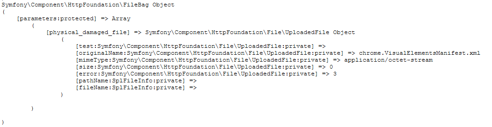

# 概念
  
  ### 持久化 

  持久化就是把放在内存的数据转而存到外存去的一个动作。因内存的数据断电而消亡，所以，将其存在外存来使得数据得以持续。即为持久化。

# 操作

  ### 文件上传
    
  - 原生php中的上传流程
  
    在原生的php中查看上传的文件信息在超级变量
    `$_FILE` 中查看，其有5个属性：
     - `$_FILE['type_name']['name']`    
        上传的原文件名 
     - `$_FILE['type_name']['type']`  
        上传文件的类型
     - `$_FILE['type_name']['error']`  
        上传文件时的错误类型:
          - 0  
          `UPLOAD_ERR_OK`: 没有错误，上传成功
          - 1  
          `UPLOAD_ERR_INI_SIZE`: 上传的文件超过了 php.ini 中`upload_max_filesize`选项的限制
          - 2  
          `UPLOAD_ERR_FORM_SIZE`: 上传文件的大小超过了HTML表单中 `MAX_FILE_SIZE` 选项指定的值
          - 3  
          `UPLOAD_ERR_PARTIAL`: 文件只有部分上传
          - 4  
          `UPLOAD_ERR_NO_FILE`: 没有文件被上传
          - 6  
          `UPLOAD_ERR_NO_TMP_DIR`: 找不到临时文件夹
          - 7  
          `UPLOAD_ERR_CANT_WRITE`: 文件写入失败
     - `$_FILE['type_name']['tmp_name']`  
        上传文件的临时文件名
     - `$_FILE['type_name']['size']`  
        上传文件的大小,以字节计算

    在文件上传成功，可以做一系列的检测，比如大小限制，图片类型判断、临时文件是否存在等等，然后把临时文件移至其他文件夹。因为临时副本会在脚本结束的时候消失。
    使用 `move_uploaded_file($_FILE['type_name']['tmp_name'],url.filename)`。

  - symfony中的上传流程 
    
    在symfony框架中，使用UploadedFile类来管理文件上传。通过访问 `$request->files` 来查看上传文件的基本信息。
    下图是打印的相关信息：

    ;

    UploadedFile类提供了方法来获取上传文件的基本信息：
      - `getExtension()`   
        获取源文件扩展名
      - `getClientSize()`  
        获取源文件大小
      - `getClientOriginalName()`  
        获取源文件名
      - `guessExtension()`  
        获取MIME扩展

    使用`move()`方法来移动文件

    在symfony中可以创建一个uploadFile类来集中控制文件上传的过程，在通过在服务中注册，便可直接在controller中获取该类并且使用该类。

    也可以选择在直接创建一个监听器，但与文件上传的字段被持久化后，自动触发该服务便可省去在controller中使用该服务的过程。详情可查看：[uploadFile](http://www.symfonychina.com/doc/current/controller/upload_file.html) [API](http://api.symfony.com/3.1/Symfony/Component/HttpFoundation/File/UploadedFile.html)


  - ### 发送邮件  
    在symfony中发送邮件使用的是插件 `swiftMailer` [symfony 插件 Swiftmailer api](https://swiftmailer.symfony.com/pdf/Swiftmailer.pdf)
    
    - 如果在发送的类型中选择使用 `html` 模板，有几点需要注意：
      + css 的样式选择不可以使用 css 中的高级选择器
      + 不可以使用 `<link>` 标签来引入外联样式
      + html 的 `<mate>` 标签 必须是 `<meta http-equiv="Content-Type" content="text/html; charset=utf-8" />` , 只写 `<meta charset='utf-8'>` 不生效;
      + 其他详细可以参考 [SwiftMailer的使用以及邮件模板中css和html设计的一些问题](http://blog.sina.com.cn/s/blog_4ac023810101hve8.html)
    

    首先要在使用的邮件中打开权限。本例子使用 163 邮箱，打开权限的操作参考一下链接。
    [163邮箱如何开启POP3/SMTP/IMAP服务？](http://help.163.com/10/0312/13/61J0LI3200752CLQ.html)

  - 简单示例
    先在 `config.yaml` 设置邮箱信息。

    ```yaml
      # parameter.yaml
      mailer_host: smtp.163.com
      mailer_transport: smtp
      mailer_user: xxxxxxx@163.com
      mailer_password: xxxxx # 设置的授权码
      secret: xxxxxxxxxxxxxxxxxxxxxx # 本来就有的
    ```

    ```php
        //php
        //声明一个 message 的实例
        $message = (new \Swift_Message('Hello Email'));

        //如果要发送图片，则需要使用 embed 处理，其返回一串 'cid:....' 以这个作为  的 src 地址；
        $cid = $message->embed(\Swift_Image::fromPath('http://pic63.nipic.com/file/20150330/8993928_082652755616_2.jpg'));
        
        //如果要发送附件 使用 $message->attach(\Swift_Attachment::fromPath('my-document.pdf'));
        //使用模板去渲染
        $datas =  $this->renderView(
            'default/email.html.twig',
                array('cid' => $cid)
            );
        
        $message->setFrom('z317628936@163.com')
        ->setTo('317628936@qq.com');
        $message->setBody($datas,'text/html');
        
    
        // 发送，得到结果
        $sendNum = $this->get('mailer')->send($message);
        return new Response(array("num"=>$sendNum));
    ```

    ```html
      <!-- default/email.html.twig -->
      <!DOCTYPE html>
      <html lang="en">
      <head>
        <meta http-equiv="Content-Type" content="text/html; charset=utf-8" />
        <title>Document</title>
        <style>
          table{
            width: 100%;
            max-width: 100%;
            margin-bottom: 1rem;
            border-collapse: collapse;
            color: #fff;
            background-color: #212529;
          }
          td{
            border-color: #32383e;
            vertical-align: bottom;
            border-bottom: 2px solid #dee2e6;
            padding: .75rem;
            border-top: 1px solid #dee2e6;
          }
          th{
            padding: .75rem;
            vertical-align: top;
            border-top: 1px solid #dee2e6;
            border-color: #32383e;
            text-align:left;
          }
        </style>
      </head>
      <body>
          <table>
          <tr>
            <th>1</th>
            <th>2</th>
            <th>3</th>
          </tr>
          <tr>
            <td>1</td>
            <td>2</td>
            <td>3</td>
          </tr>
        </table>
      
      </body>
      </html>
    ```

