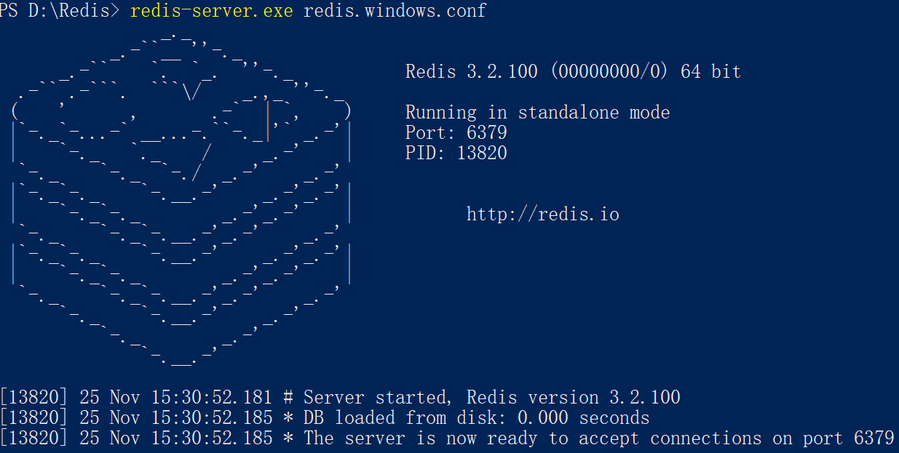

- ### 下载安装redis
    - 下载
        + [地址](https://github.com/MicrosoftArchive/redis/releases)
    - 解压
        + 解压至指定目录(目录可以自定义，比如`D:\Redis`)
    - 启动redis
        + 在该根目录下输入 `redis-server.exe redis.windows.conf` 即可以启动redis  
        
    - 配置全局变量来打开redis
        + 在该目录下创建 `redis.bat`文件
            * 将下面内容放入文件

            ```bat
                rem 启动redis数据库--服务端
                @echo off

                rem redis的安装顶层目录
                d:

                rem 设置显示文字颜色
                color 0a

                rem 修改当前目录到bin下
                cd D:/redis/bin

                rem 启动
                redis-server.exe redis.conf
            ```
            * 添加环境变量，这里是`D:\Redis` 
            * 现在在路径下的cmd都可以使用`redis`打开redis服务器
        + 在该目录下创建 `redis-cli.bat`文件
            * 将下面内容放入文件
            ```bat
                rem 启动redis数据库--客户端

                @echo off

                rem redis的安装顶层目录

                d:

                rem 设置显示文字颜色

                color 0a

                rem 修改当前目录到bin下

                cd D:/redis

                rem 启动客户端

                redis-cli.exe -h 127.0.0.1 -p 6379
            ```
            * 现在在路径下的cmd都可以使用`redis-cli`打开redis客户端
