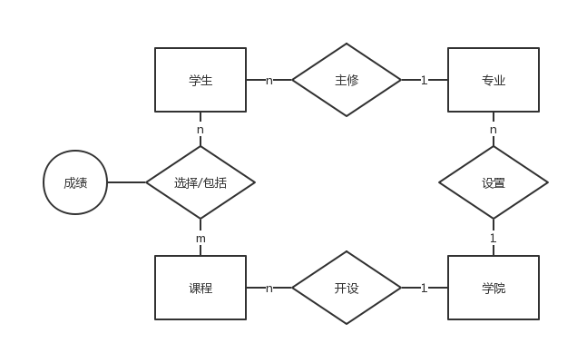
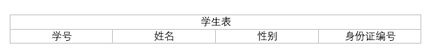
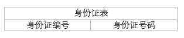
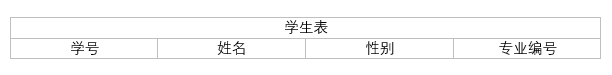
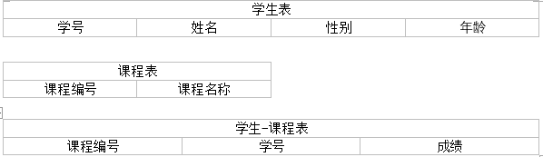
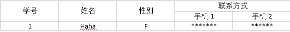
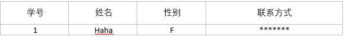
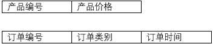
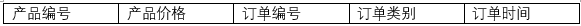
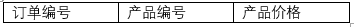

1. ### 数据库设计
    - #### 数据库设计在软件开发中所处的地位
        + 软件开发周期
            * 需求分析阶段  分析客户的业务需求和数据处理需求
            * 概要设计阶段  设计数据库的E-R图，确认需求信息的正确和完整
            * 详细设计阶段  将E-R图转换为多张表，进行逻辑设计，并应用数据库设计的三大范式进行审核
            * 代码编写阶段  选择具体数据库进行物理实现
            * 软件测试阶段
            * 安装部署
        + 数据库设计阶段分步
            * 需求分析  独立于任何数据库管理系统
            * 概念结构设计  独立于任何数据库管理系统
            * 逻辑结构设计  与选用的DBMS密切相关
            * 物理结构设计  与选用的DBMS密切相关
            * 数据库实施
            * 数据库运行和维护
    - #### 数据库设计案例
        + 概念结构设计 —— 数据抽象与局部视图
            * 分类：将同一类的事务划分成一个E-R图的实体(如老师、学生)
            * 聚集：确定实体的组成部分，对应于E-R图的属性
            * 下图就是E-R中的实体以及其对应的属性  
                
        + 逻辑结构设计 —— 向关系模型转换
            * 实体键关系的转换规则
                - 一个1:1关系可以转换为一个独立的关系模式，也可以与任意一端所对应的关系模式合并 
                - 一个1:n关系可以转换为一个独立的关系模式，也可以与n端多对应的关系模式合并
                - 一个m:n关系转换为一个关系模式。转换的方法为:与该关系相连的各实体的码以及关系本身的属性均转换为关系的属性，新关系的码为两个相连实体码的组合
                - 三个或三个以上实体间的多元关系转换为一个关系模式
            * 实体键关系(自联系)的转换原则
                - 同一个实体集的实体间的联系，称为自联系，也可按上述实体键关系的转换规则处理，同样也存在 1:1, 1:n, n:m 的关系
                - 比如在学生表中有一个字段是表示班长的，而班长又是一个学生，这就属于自联系中的1:n
            * 将上述概念结构设计转化成逻辑结构设计为下图
                
                - 转化过程
                    + 在1:1的关系中，可以将两个表合成一个表，也可以通过一个字段的关联将一个表拆分成两个表。比如，学生和身份证。可以建立一个学生表，一个身份证表，由于其实1:1的关系，所以可以通过在学生总增加一个字段去关联身份证表，或者在身份证表中建立一个字段去关联学生表  
                      
                    
                    + 在1：N的关系中，在N的表中建立一个字段去关联1的表即可。如学生和专业，可以在学生字段中添加一个字段代表其所对应的专业。
                      
                    
                    + 在N:M的关系中则需要在建立一张新的表去表示关系。如课程和学生，需要建立一张新的表，其中包含代表课程的字段、学生的字段以及其关系(这里可以是成绩)的字段。当然，这个新建的表不一定只是表示两个实体的多对多的关系，也可以表示三个或者三个以上的实体的关系，只要有字段代表即可。比如说学生、课程、考场，可以有的字段就是学生编号，课程编号，考场编号，成绩。
                      
    - #### 数据库设计规范
        + 数据库设计三范式
            * 第一范式(1NF) 属性不可分  
                - 目标: 确保每列的原子性
                - 如果每列都是不可再分的最小数据单元，则满足第一范式
                - 示例  
                  
                
            * 第二范式(2NF) 
                - 每个表只描述一件事情
                - 每条记录有唯一标识列
                - 示例 产品的价格只依赖与产品，订单的时间只依赖与订单。应该分成两个表   
                  
                  
            * 第三范式(3NF)
                - 数据库表中不包含已在其他表中已包含的非主关键字信息
                - 示例 在产品的表中已经记录产品价格，这里就没必要在记录的  
                
            * 第四范式(4NF)
            * 第五范式(5NF)
            * BC范式(BCNF)
            * 满足最低要求的范式是第一范式。在第一范式的基础上进一步满足更多要求的称为第二范式，其余范式以此类推。一般说来，数据库只需要满足第三范式就行了。
        + 良好的数据库设计
            * 节省数据的存储空间
            * 能够保证数据的完整性
            * 方便进行数据库应用系统的开发
        + 糟糕的数据库设计
            * 数据冗余、存储空间浪费
                - 更新异常，就是修改一个字段的内容要对多条记录进行修改
                - 添加异常，添加一条记录可能会需要虚拟一些暂时还不存在的数据
                - 删除异常，删除一条记录的时候，可能会把其他相关的记录一并删除
            * 内存空间浪费
            * 数据更新和插入的异常
2. ### 数据库开发基础
    - #### SQL语句的类型 批 注释 标识符
        - Ttansact-SQL 语句的类型
            + 数据定义语言(Date Definition Language,DDL)语句: DDL语句通过生成数据库，表、和用户自定义的数据库
                * create object_name 创建
                * alter object_name 修改
                * drop object_name 删除
            + 数据控制语言(Date Control Language,DCL)语句: 改变某个用户或角色相关联的权限
                * grant 授予权限  
                    `grant select on table_name to public`
                * deny 拒绝权限  
                    `deny select on table_name to public`
                * revoke 取消权限
            + 数据操作语言(Date Manipulation Language,DML): 操作数据库中的数据。
                * select
                * insert
                * delete
                * update
        - Ttansact-SQL 语句的语法要素
            + 批处理
                * `go`
                    一个批处理命令通知 SQLServer 分析并运行一个批处理的所有指令(它实际上并不是一个Ttansact-SQL语句，只是描述一个批处理，用来将语句划分。局部变量作用范围局限在一个批内，`go`必须独占一行)
                * `Exec`
                    用于执行用户自定义的函数，系统存储过程，用户自定义的存储过程或扩展存储过程
            + 注释语句
                * 行注释 `--`
                * 块注释 `/**/`
        - 标识符
            + 标准标识符 比如表名就是一个标识符
                * 第一个字符是a-zA-Z
                * 第一个字符后可以是数字，字母，或各种符号`@`,`$`,`_`
                * `@` 代表局部变量(@age 就是一个变量)  
                    ```sql
                        set @age = 10
                    ```
                * `#` 代表临时表和存储过程(临时表表示一个用户创建的，其他用户不可以使用。当数据库关闭的时候就消失了)
                     ```sql
                        create table #t
                        {
                            Tage int,
                            Tname nvarchar(10)
                        }
                     ```
                * `##` 代表一个全局临时表(全局临时表表示一个用户创建的，其他用户也可以使用。当数据库关闭的时候就消失了)
                    ```sql
                        create table ##t
                        {
                            Tage int,
                            Tname nvarchar(10)
                        }
                    ```
            + 限定标识符 
                * 当对象名包含空格时，当保留关键字被用作对象的姓名时，必须使用括号和引号把限定标识符括起来
                ```sql
                    create table [order detail]
                    {
                        ....
                    }

                    select * from [order detail]
                    -- 使用双引号界定符要打开
                    set quoted_identifier on
                    -- set quoted_identifier off
                    select * from "order detail"
                ```
    - #### 数据库中数据类型
        - 数字型
            + 数字:int,tinyint,smallint,bigint
            + 十进制小数:money,smallmoney,decimal
            + 浮点数
            + real
        - 日期型
            + datetime
        - 字符型
            + 定长字符 
                * char(20) 1个字符占用1个字节(英语)
                * nchar(20) 1个字符占用2个字节
            + 变长字符 varchar(20)
                * varchar(20) 1个字符占用1个字节(英语)
                * nvarchar(20) 1个字符占用2个字节
        - 二进制型
        - 唯一标识 代表一个全局特殊标识符，是一个16位16进制的值
        - SQL变量 包括SQL所支持的各种数据类型
        - 位图和文本 属于大型二进制对象结构
        - 表 代表一个表结构，将一个表保存在一个字段中
        - 游标 用于存储过程的编程
        - 用户自定义数据类型
    - #### 变量 函数 数据类型转换
        - 数据库中的变量
            ```sql
                -- 声明变量
                declare @sname varchar(10),@address nvarchar(10)
                -- 赋值
                set @address = "mimee"
                select @address = "mimee"
                -- 全局变量
                select @@version
                select @@servername
            ```
        - 函数
            + 系统函数
                * 聚集函数，对于一个 *集合*中的值进行运算，返回一个 *单一的，汇总的*值
                ```sql
                    select avg(column) as avg_num from tablename

                    -- 0到100的整数
                    declare @r int
                    set @r = rand() * 100
                    select @r
                ```
                * 标量函数，只对 *单个值*进行运算并返回 *单一*的值，只要表达式正确，就可以使用这些函数
                ```sql
                    select DB_name() as 'database'
                ```
                * 系统函数范例
                    ```sql
                        -- 时间转化为其它格式，convert()可以转换数据类型
                        -- convert(varchar,10);
                        select 'ansi:',convert(varchar(30),getdate(),102) as style
                        union
                        select 'janpanese:',convert(varchar(30),getdate(),111) as style
                        union
                        select 'European:',convert(varchar(30),getdate(),113) as style
                    ```
                * 数学运算符
                    - `+ - * / %`
                    - `= < > >= <=`
                    - 字符串连接使用 `+`，空字符不等于空值
                    - 逻辑运算符`and or not`
                * 表达式
                    - 表达式是各种符号和对单个数据进行操作  
                    `select column1+column form tablename`
    - #### SQL的日期函数
        + `getdate()` 获取系统的当前时间
        + `Year(getdate())` 获取年份
        + `Month(getdate())` 获取月份
        + `Day(getdate())` 获取日期
        + `dateadd(yy,4,(getdate()))` 表示对当前时间加上4年，
            * yy 表示年
            * qq 表示季度
            * mm 表示月
            * wk 表示周
            * hh 表示小时
            * mi 表示分钟
            * ss 表示秒
            * dy 表示一年中的第几天
        + datediff(day,'2005-5-3',getdate()) 返回时间差
        + datepart(day,getdate())
    - #### 数据库开发中用到的流程控制语句
        + 判断语句 
            * if 条件 .... else ....
            * case (变量) when (条件) (执行的语句) when (条件) (执行的语句) else (执行的语句) end
            ```sql
                case when @score < 60 then ...
                     when @score > 60 and  @score < 70 then ...
                     else ....
                     end

                declare @score decimal
                set @score = 50 + rand() * 50
                if (@score < 60) 
                begin
                    print '不及格'
                    print '不及格'
                end
                else
                    print '及格'
            ```
        + 循环语句
            * while (条件)
            ```sql
                declare @times int,@a varchar(100)
                set @times = 0
                set @a = "*"
                while (@times < 20)
                begin 
                    print @a
                    @a = @a + "*"
                    @times = @times + 1
                end
            ```
    - #### 使用SQL帮助和动态构造SQL语句
        + 选中某个关键字，单击F1即可打开SQL帮助
        + 动态构建SQL语句
            * 当SQL语句中有变量的时候，不可以直接使用使用该语句会报错应该配合`execute()`使用
            ```sql
                declare @tablename nvarchar(20)
                set @tableName = "T" + convert(varchar(4),Year(getdate())) + "年" + convert(varchar(2),Month(getdate())) + "月"
                execute( 'create table ' + @tablename + '(studentid int, studentname nvarchar(10))')
            ```
3. ### 数据查询
    - #### 数据查询
        + 列筛选和行筛选
            * 使用`select`可以指定列，使用`where`可以指定行
            * 过滤数据  
                - 使用比较运算符 `= > < >= <= <>`
                - 使用字符比较符 `like` 
                    + % 0个或多个字符串，类似正则匹配中的 `.*`
                    `SELECT * FROM tablename where column like '%明'`查找什么什么明(王明，阿斯顿发送到明，阿道夫李明..)
                    + _ 任何单个的字符，类似正则匹配中的 `.`
                    `SELECT * FROM tablename where column like '_明'`查找什么明(王明，李明..)
                    + \[\] 在指定区域或集合内的任何单个字符，使用逗号隔开
                    `SELECT * FROM tablename where column like '_[明,哈]_'`查找什么明什么或者什么哈什么(王明看，李明其，李哈其，额哈其..)
                    + \[^\] 不在指定区域或集合内的任何单个字符 
                - 使用逻辑字符
                    + `and or not`
                - 查询一定范围的值
                    + `between and`/`not between and`  
                    `select * from tablename where mark between 70 and 80`   等价于  
                    `select * from tablename where mark >= 70 and mark <= 80`  
                    **使用`between`的查找效率大于使用`and`和比较运算符**
                - 使用值得列表作为搜索条件
                    + 使用 in 或者使用 or 操作符连接起来的一系列比较符，SQLServer 在处理他们的方式相同。不要在搜索条件结尾使用NULL，这将返回意想不到的结果。可以使用 not in，降低数据查询速度
                - 查询空值
                    + 使用 is null  
                    `select * from table where column is null`
                    + 使用 is not null查询非空值  
                    `select * from table where column is not null` 
        + 格式化查询结果
            * `order by` 使得结果集排序，`ASE` 升序，`DESE` 降序
            * `distinct` 去除某重复值
                `select distinct column from tablename `
            * `AS` 取别名，也可省略不写
                `select column as 'a' from tablename`
            * 写sql语句的时候，列与列使用 ** , ** 隔开，可以随意添加多个列
                `select 'a','b','c',column from tablename`
        + 查询的工作原理
            * 非缓存查询，所有查询在执行前都要经过以下步骤：解释、解析、优化、编译
                - 解释 检查语句的语法是否正确
                - 解析 校验语句中出现的对象名称是否有效，同时检查对象的所有权的权限
                - 优化 检查是否能够使用索引并决定联合策略
                - 编译 把查询翻译为一个可执行的表
                - 执行 把编译过程的查询要求提交并进行处理
            * 缓存查询  
                为了提高性能，SQLServer能够保存编译过的查询计划供以后使用，查询计划是经过优化的指令，他指定了如何处理查询并访问数据。
            * 查询是如何被自动缓存的  
                被缓存的查询保存在内存中一个叫做过程缓存的地方，在下列两种情况下，查询将被自动缓存
                - 特定的批 
                    ```sql
                        -- 以下两句将会使用相同的缓存计划
                        select * from procducts where cost = '$ 12.5'
                        select * from procducts where cost = '$ 13.5'
                        -- 下面一句变量不同不会和上面两句使用相同的查询计划
                        select * from procducts where cost = 13.5
                    ```
                - 自动化参数
            * 影响性能的注意事项
                - 尽量使用正逻辑而不是非逻辑，非逻辑操作(not between, not in, not null)可能会降低查询速度，因为它要检索数据表中的所有行
                - 如果能够使用一个更确定的查询，就尽量避免使用关键字LIKE，使用LIKE查询，查询速度可能会降低
                - 如果可能，尽量在搜索条件中使用精确的比较或值的域
                - 使用ORDER BY子句可能会降低数据查询速度
            * 使用系统函数
                - sp_who 显示服务器上所有正在产生的活动
                - select @@Spid 想知道那些活动是你的
                - exec sp_who 56 将显示和你的服务器进程号有关的所有活动
                - select user_name()
                - select DB_name()
                - select @@servername
        + 多表查询
            * 内连接，在每个表中找出符合条件的共有记录
                - 关键字 `join on`/`inner join on`
            * 外连接
                - 左外连接 `left join on`
                - 右外连接 `right join on`
            * 自连接
                - 应用：查询表中某个field中相同的内容有哪些
            * 合并多个结果集 `union`
                - 要求：结果集的colmun完全相同
        + 在数据查询中使用top参数
            ```sql
                -- 选出前5个
                select top 5 * from tablename order by column ASE;
            ```
        + 聚集函数
            可以在`select`语句中单独使用聚集函数，也可以与语句`group by`联合使用。除了`count`函数，如果没有满足`where` 子句的记录，则所有的聚集函数都将返回空值，`count`返回 0。
            - `count()`
                当参数是`*`的时候，统计记录；当参数是列的时候统计列中不是空值的数量
            - `sum()`
            - `min()`
            - `max()`
            - `avg()`
        + 使用`group by`进行分组汇总
            如果使用聚集函数，则将对表中的所有记录的某个字段进行汇总。然后生成单个的值。如果想生成多个汇总值，同时使用聚集函数和`group by`语句，联合使用`having`和`group by`子句能够是的结果集只包含满足条件的记录
            - 联合使用`having`和`group by`子句
            `select subject,avg(score) as avgs from student group by subject having avgs > 80` `having`后面跟的是筛选条件
            - 分组汇总
                + 统计每个班有多少个学生
                `select Class,count(*) from student group by Class`
                + 统计男生女生的数量
                `select sex,count(*) from student group by sex`
                + 统计每科的平均分
                `select subject,avg(score) from student group by subject`
            - 多列分组汇总
                + 需求：求三个班的三个科目的总成绩
                + 思路：请对根据科目分组，咱根据分组结果去对应三个班的成绩
                + sql语句  
                ```sql
                    -- 在group by后面接的参数，是先按照subject分组，再按照Class分组
                    SELECT Class,subject,sum(score) from student group by subject,Class
                ```
                + 分组汇总中使用`cube`和`rollup`参数
                + `rollup`参数，将两列的详细信息和分组汇总
                ```sql
                    SELECT Class,subject,sum(score) from student group by subject,Class with rollup
                ```
                + `cube`将列出的subject，Class两列进行汇总
                ```sql
                    SELECT Class,subject,sum(score) from student group by subject,Class with cube
                ```
                + `grouping(column)` 判断该条记录是否是由该个column进行汇总的，是则输出1，不是则输出0
                ```sql
                    SELECT Class,grouping(Class),subject,grouping(subject),sum(score) from student group by subject,Class with cube
                ```
        + 子查询
            子查询可以吧一个复杂的查询分解成一系列逻辑步骤，这样就可以用一个单个的局域解决复杂的查询问题。  
            对于选择连接还是子查询，其实执行效率差不多，但是子查询可能要求查询优化器执行额外的操作，比如排序，而这些操作将会影响查询的处理策略
            - 使用
                + 查看每个学生成绩与平均分的差距(把子查询用作表达式)
                    * 思路：首先得到平均分，再做减法运算
                    ```sql
                        SELECT 
                            s_id,
                            subject,
                            -- 查询得到平均分
                            score - (SELECT avg(score) from tablename) 
                        from 
                            tablename

                        -- 扩展
                        SELECT 
                            s_id,
                            subject,
                            -- 查询得到平均分
                            case
                                when
                                    (score - (SELECT avg(score) from tablename)) > 0
                                then 
                                    '高于平均分'
                                else
                                    '低于平均分'
                        from 
                            tablename
                    ```
                + 查找平均分低于60分的学生的学号，姓名(用子查询当做派生的表)
                    * 思路：先得到每一个学生的平均分，筛选出平均分低于60分的同学，根据筛选的结果集中的s_id去寻找学生的姓名
                    * sql
                    ```sql
                        -- 得到每一个学生的平均分
                        SELECT s_id,avg(score) from student group by s_id
                        -- 筛选出平均分低于60分的同学
                        SELECT s_id,avg(score) as avgs from student group by s_id having avgs < 60
                        -- 将上述的结果当成一个表，去查询最终结果
                        SELECT 
                            * 
                        from 
                            student
                        where 
                            s_id 
                        in 
                            (SELECT s_id from
                                (SELECT s_id,avg(score) as avgs from student group by s_id having avgs < 60) as t
                            )
                    ```
4. ### 数据增删改
    - #### 插入 
        + `insert tablename (column) values (value)`   
        或者
          `insert tablename values (value)` 
        + 将查询后的数据插入一张新表(已创建)中
            `insert newtablename select * from oldtablename`
        + 将查询后的数据插入一张新表(未创建)中
            `select * into newtablename from oldtablename`
    - #### 删除
        + `delete tablename $condition`
        + delete后面接一张大表，可以删除整个大表的内容  
        `delete tablename from tablename a join tablename b on a.id = b.id where a.mark < 60`
    - #### 修改
        + `update tablename set $column = $value where $condition`
        + update后面接一个大表，更新大表的内容  
        `update tablename set $column = $value FROM tableone a join tabletwo b on a.id = b.id where a.id > 10`