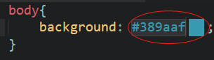
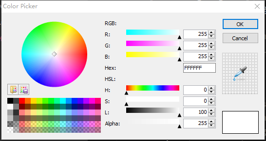
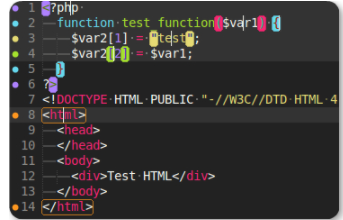

# sublime安装的插件

- ## markdown
    + [Markdown Editing](https://github.com/SublimeText-Markdown/MarkdownEditing)
    + [MarkdownLivePreview](https://github.com/math2001/MarkdownLivePreview)  
        MarkdownLivePreview可以实现实时预览,在首选项->Package Setting里修改MarkdownLivePreview的user配置文件,设置在打开时同步预览;

        ```javascript
        "markdown_live_preview_on_open": true
        ```

    + [Markdown Preview](https://github.com/facelessuser/MarkdownPreview)  
        这个插件不能实时预览,但你可以设置快捷键让它在浏览器中预览,在首选项->快捷键设置里添加  

        ```javascript
        { 
            "keys": ["alt+m"], 
            "command": "markdown_preview", 
            "args": {
                "target": "browser", 
                "parser":"markdown"
            } 
        }
        ```

    + [All Autocomplete](https://github.com/alienhard/SublimeAllAutocomplete)  
        　Sublime Text 默认的 Autocomplete 功能只考虑当前的文件，而 AllAutocomplete 插件会搜索所有打开的文件来寻找匹配的提示词。

    + [Color Highlighter](https://github.com/Monnoroch/ColorHighlighter)  
        一个在css中可以直观看到颜色的插件，同时单击右键选择 *Insert color with color picker* 就可以调出颜色选择面板。
        
        

    + [BracketHighlighter](https://github.com/facelessuser/BracketHighlighter)  
        配置文件的高亮设置，让你的代码有不同的颜色区分该插件提供配对标签，或大括号或字符引号的配对高亮显示，算是对系统高亮的加强吧。   
        


- ## 主题
    + [Material Theme](https://github.com/equinusocio/material-theme)
    + [Seti_UI](https://github.com/ctf0/Seti_ST3)
    + [Boxy Theme](https://github.com/ihodev/sublime-boxy)
    + [Agila](https://github.com/arvi/Agila-Theme)


