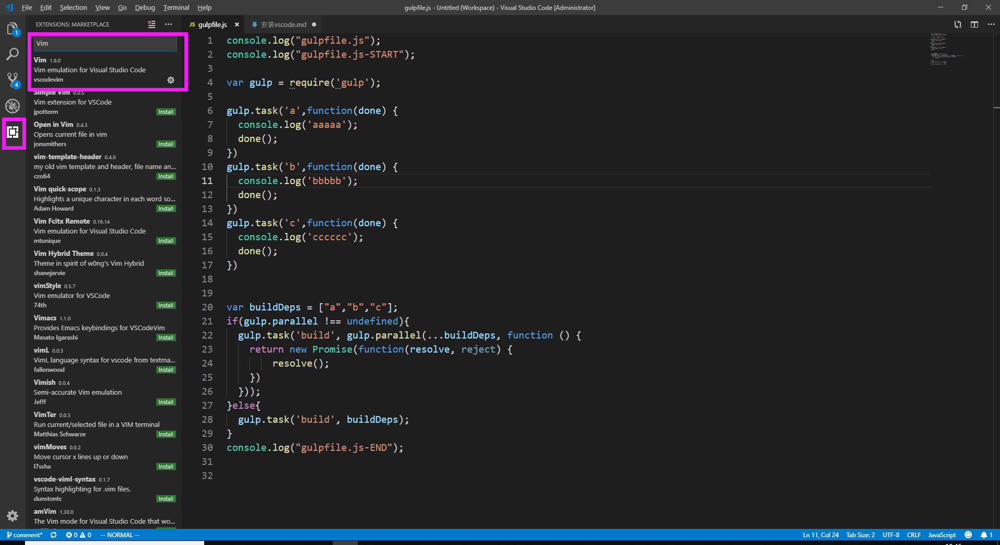
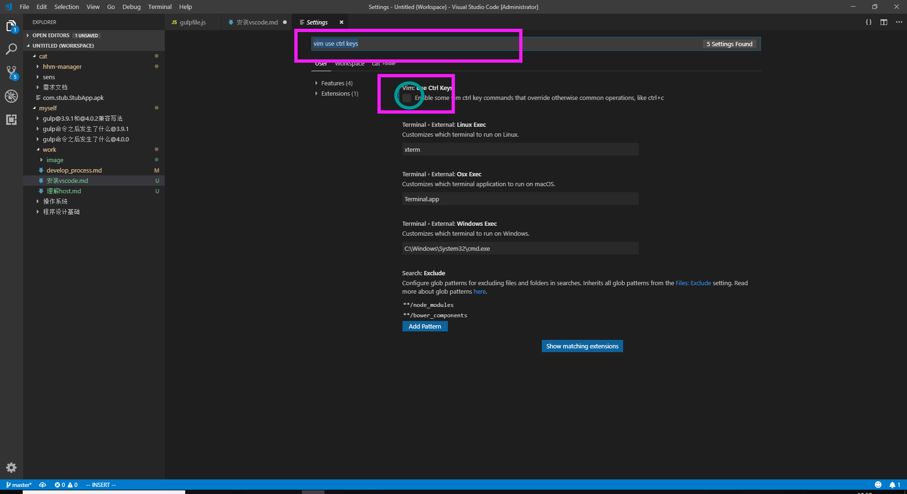
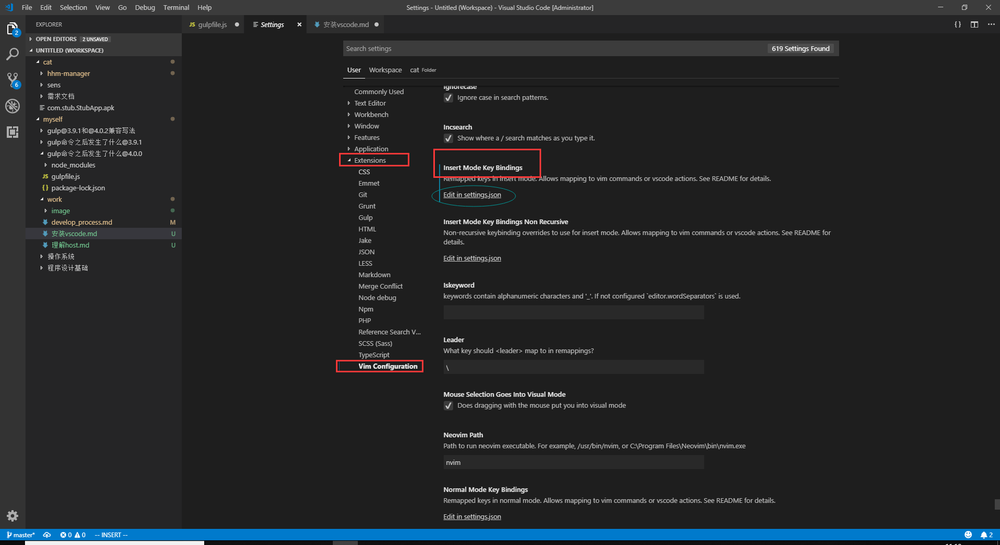
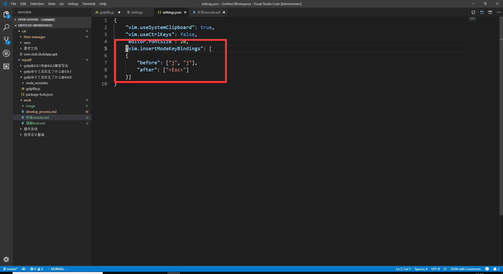
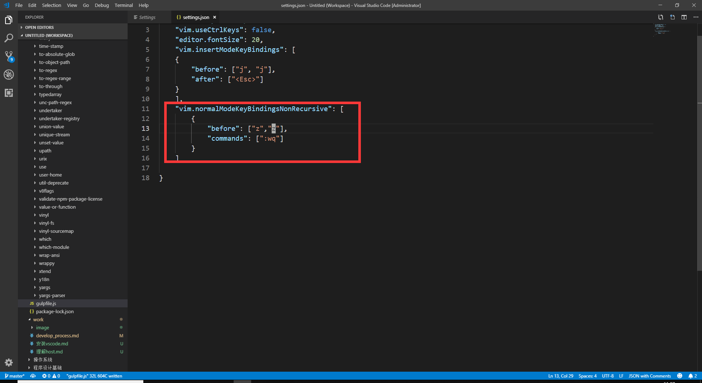
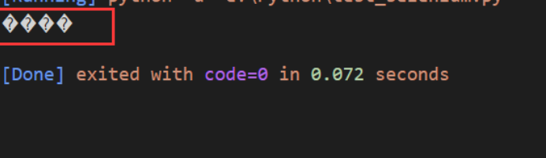
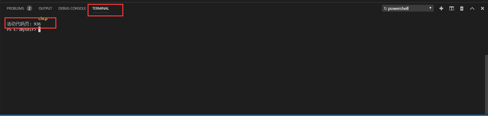
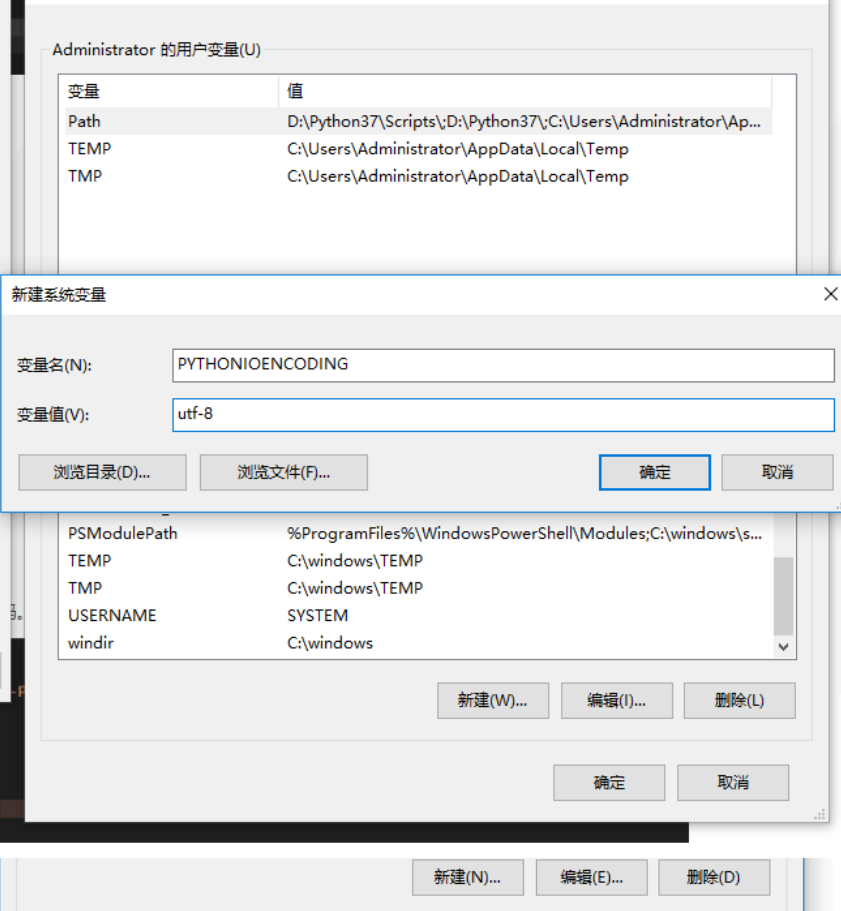
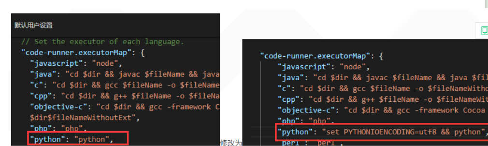

#

## 安装VsCode

[VsCode](https://code.visualstudio.com/)是一款很轻量的编辑器，对Vim的支持也很好。

## 插件安装

- ### vim

    在Extension中搜索vim，点击安装即可。  
    ;

  - **快捷键设置**

    - 使用系统自带的粘贴和复制: FILE->Preference->Setting, 搜索vim use ctrl keys将该选项勾选掉。  
        
    - 置换常用键，比如把ESC换成jj，把:换成;  
        FILE->Preference->Setting, 在User中选择Extension, 找到 Insert Mode Key Bindings，点击 Edit in settings.json  
        ;  
        添加如下键值对:该例子是把原来ESC设置为 jj ;

        ```json
            "vim.insertModeKeyBindings": [
            {
                "before": ["j", "j"],
                "after": ["<Esc>"]
            }]
        ```

          
        使用ZZ替代保存退出

        ```json
            "vim.normalModeKeyBindingsNonRecursive": [
                {
                    "before": ["z","z"],
                    "commands": [":wq"]
                }
            ]
        ```

        

        *注意：`vim.insertModeKeyBindings` 表示的是vim在 **insert** 模式下的键盘映射,`vim.normalModeKeyBindingsNonRecursive` 表示在 **normal** 模式下的键盘映射*

- ### [im-select](https://github.com/daipeihust/im-select)可以解决vim中insert和normal模式切换时候，中英文转换的麻烦。就是如果输入法默认是中文，在insert模式切换到normal模式的时候，也会自动转成中文输入法。但是我们希望在normal模式下，自动是英文输入法。

- ### [更多插件](https://www.cnblogs.com/parry/p/vscode_top_ten_plugins.html)

- ### 使用过程中所遇到的问题

  - 运行代码时候，会出现中文乱码
  
  

  解决方法：其实vscode调用的是系统的cmd。所以可以设置系统的cmd的编码。
    1. 可以通过chcp命令查看cmd的编码设置，GBK2312的代码页编号是936，然后改成utf-8的编码即可，utf-8对应的代码页编号是65001，所以执行chcp 65001就可以把cmd的编码设置成uft-8了，这样就解决了乱码问题  
    

    2. 通过添加环境变量(测试用的python)；在环境变量里添加一个变量设置:PYTHONIOENCODING=utf-8  
    

    3. 可以通过设置编译参数，指定使用UTF-8编码:"python": "set PYTHONIOENCODING=utf8 && python"
    