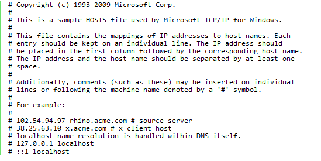
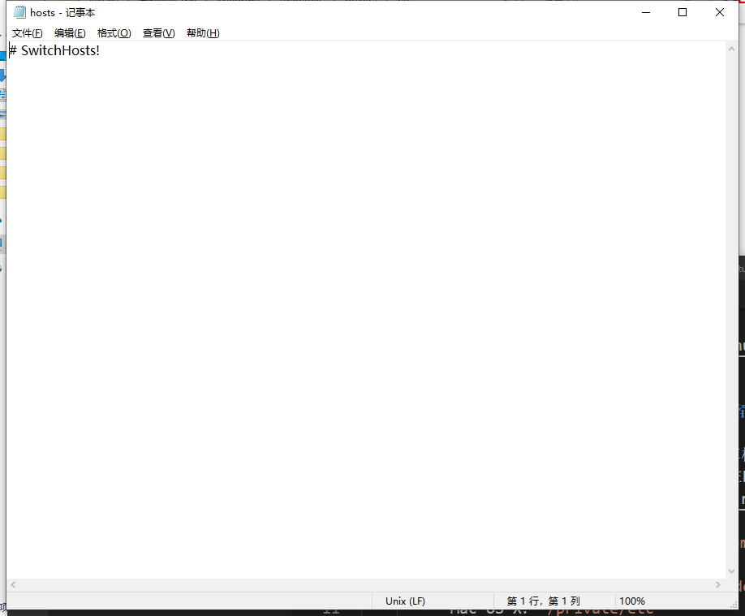

# 理解host

## 20190522

在工作中，使用 [SwitchHost](http://oldj.github.io/SwitchHosts/) 来切换host来访问测试环境，预发环境，线上等等。那么为什么切换host就切换不同的环境呢？
    - ### 什么是host  
        *host* 在计算中表示 **主机**或者 **宿主**的意思，比如情报加工商或者联机资料的供应商。  
        *hosts* 则是一个没有扩展名的系统文件，其作用类似于一个数据库，其中存储着网址域名以及其对应ip的键值对。他的作用是：在计算机访问网络的时候，计算机优先会在本机的hosts文件中去寻找域名所对应ip地址，如果找到ip地址，就会根据该ip地址去访问网站，如果在hosts文件中找不到，则会向DNS域名解析服务器发出请求，寻找其对应的ip。([域名与ip的关系](域名与ip的关系.md))
    - ### hosts的存储位置
        - windows: 一般在 `C:\Windows\System32\drivers\etc`
        - Linux及其他类Unix操作系统：`/etc/`
        - Mac OS 9及更早的系统：`System Folder: Preferences` 或 `System folder`
        - Mac OS X：`/private/etc`
    - ### hosts的内容
          
          
