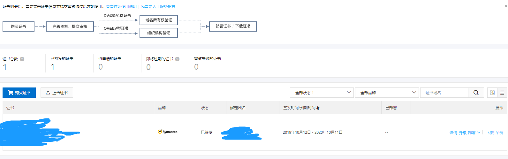
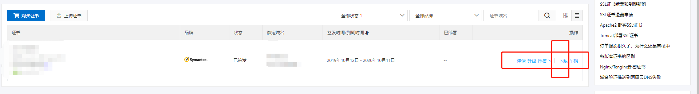
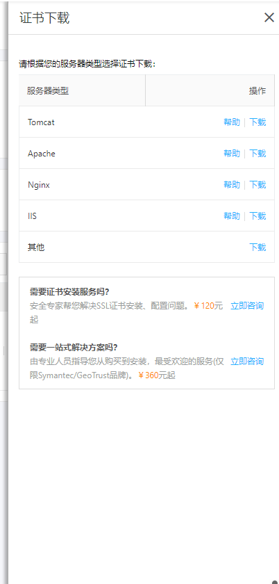
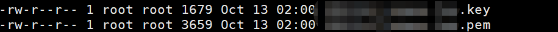

### SSL是什么

SSL(Secure Sockets Layer 安全套接层),及其继任者传输层安全（Transport Layer Security，TLS）是为网络通信提供安全及数据完整性的一种安全协议。TLS与SSL在传输层与应用层之间对网络连接进行加密。

### 申请免费SSL

可以在阿里云 [阿里云](https://common-buy.aliyun.com/?spm=5176.2020520163.cas.1.zTLyhO&commodityCode=cas#/buy) 中 **购买** 到免费的ssl，并且根据提示操作，进行相关资料的填写以及 **验证**。


### 部署ssl (nginx)

- 下载对应服务器类型的证书 
      
      

- nginx相关命令行操作

    + 新建文件夹 `mikdir folderName`, 

- 建立
    + 比如我建的文件夹的目录 `/application/ssl`
    + 将证书文件上传至该目录并且解压可得到两个文件 
        
    + 将解压的文件移动到 ngnix/conf/cert/`nginx`的`conf`下
    + 编辑 `nginx.conf` 文件
    + 将以下配置文件的注释删除，并且配置以下信息

    ```
       # 以下属性中以ssl开头的属性代表与证书配置有关，其他属性请根据自己的需要进行配置。
        server {
            listen 443;
            server_name localhost;  # localhost修改为您证书绑定的域名。
            ssl on;   #设置为on启用SSL功能。
            root html;
            index index.html index.htm;
            ssl_certificate cert/domain name.pem;   #将domain name.pem替换成您证书的文件名。
            ssl_certificate_key cert/domain name.key;   #将domain name.key替换成您证书的密钥文件名。
            ssl_session_timeout 5m;
            ssl_ciphers ECDHE-RSA-AES128-GCM-SHA256:ECDHE:ECDH:AES:HIGH:!NULL:!aNULL:!MD5:!ADH:!RC4;  #使用此加密套件。
            ssl_protocols TLSv1 TLSv1.1 TLSv1.2;   #使用该协议进行配置。
            ssl_prefer_server_ciphers on;   
            location / {
                root html;   #站点目录。
                index index.html index.htm;   
            }
        }

    ```

    + 设置http请求自动跳转https。在需要跳转的http站点下添加以下rewrite语句，实现http访问自动跳转到https页面

    ```
    server {
     listen 80;
     server_name localhost; 
     rewrite ^(.*)$ https://$host$1 permanent;
     location / {
        index index.html index.htm;
        }
    }
    ```

### 参考链接

- [Nginx配置SSL证书——采用腾讯云SSL证书配置Nginx使用https访问](https://blog.csdn.net/weixin_38111957/article/details/81283878)
- [在阿里云里申请免费Https证书SSL](https://www.cnblogs.com/lxf1117/p/6650647.html)
- [nginx和ssl的安装使用](https://www.cnblogs.com/hushunwei/p/9188770.html)

