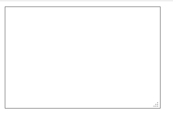
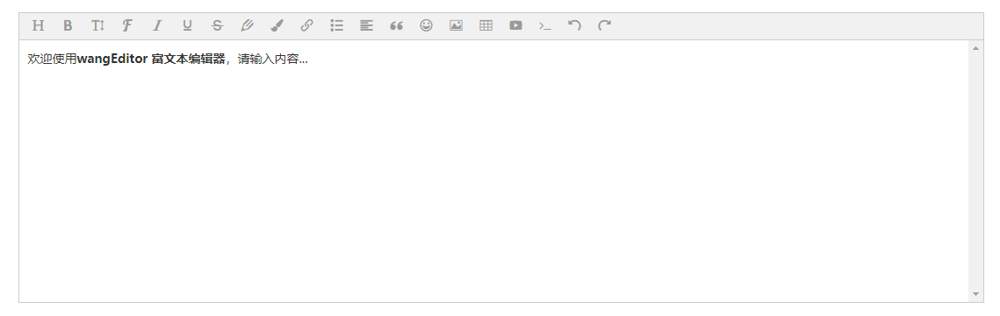
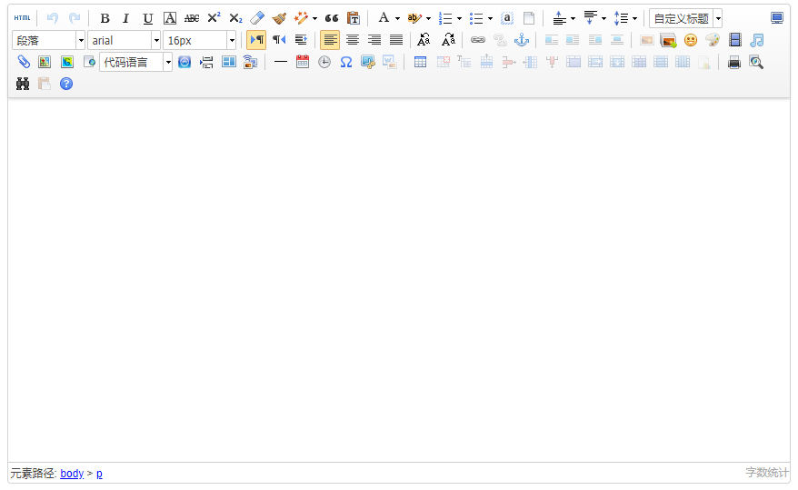
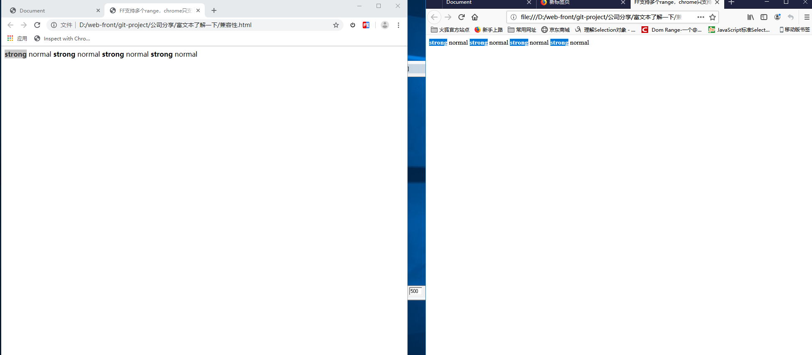

# 思考路线

- 了解富文本

- 知道富文本功能实现的核心

- 在富文本中实现图片拖拽

- 直接粘贴复制就可上传图片如何实现

- 移动端的富文本

1. #### 富文本是什么

    - 富文本的进化史

      
      
      
    百度百科解释：富文本编辑器，Rich Text Editor, 简称 RTE, 它提供类似于 Microsoft Word 的编辑功能，容易被不会编写 HTML 的用户并需要设置各种文本格式的用户所喜爱。它的应用也越来越广泛。

    - 实现核心HTML属性和js API
        
        - contenteditable 属性  
            当给一个标签添加了contenteditable 属性，就可以对其进行任意编辑，如果在该标签中有子标签不想被编辑，将其值设置为 false即可。  

            ```HTML
            <div contenteditable="true"></div>
            ```

            <iframe height=500 width=500 src="gif/20190622_1.gif">

        - document.execCommand 允许运行命令来操纵可编辑内容区域的元素  
            `document.exeCommand(命令名称-fontSize, 是否展示用户界面-false, 命令需要额外参数-1)`;     
            ** [execCommend MDN 参考文档](https://developer.mozilla.org/zh-CN/docs/Web/API/Document/execCommand) **;  
            第二个参数是因为早先IE有一个这样的参数，现在这个参数基本没什么影响。

            ```HTML
                <div contenteditable="true"></div>
                <button id="btn">bold</button>
            ```

            ```js
            document.querySelector('#btn').addEventListener('click',()=>{
                bold();
            },false);

            function bold(){
                document.execCommand('bold',false,null);
            }
            ```

            <iframe height=500 width=500 src="gif/20190622_2.gif">


        - Selection, Range 对象
            - [Selection](https://developer.mozilla.org/zh-CN/docs/Web/API/Selection)对象：表示用户选择的范围或光标位置

                - 获取Selection对象
                    - IE获取Selection: document.selection (IE8以下)
                    - FF获取Selection: window.getSelection

                - 相关方法
                    - toString 显示获得的内容，字符串形式，包括所有range 的
                    
                    ```js
                        console.log(window.getSelection().toString())
                    ```

                    <iframe height=500 width=500 src="gif/20190623_1.gif">

                    - `addRange(rangeObj)` (FF支持多个range，chrome只支持一个)  

                      

            

            - [Range](https://developer.mozilla.org/zh-CN/docs/Web/API/Range)对象：表示包含节点和部分文本节点的文档片段
                - 获取range的方法
                    - 从 Selection对象中获取 `window.getSelection().getRangeAt(index)`
                    - 创建 `document.createRange()`

                - selectNodeContents方法，传入一个节点作为range的内容

            

    - [例子](example.html)

    - bug
        - 失去焦点，这里使用的是button，所以不会失去焦点，但是，如果使用其他的，就会失去焦点。
        - 不要改写 document.execCommand，因为有一个 undo， redo栈 保存操作步骤
        - formatBlock，好像是对可编辑区域的所有内容都包括在一个标签内
    
    - 知识点
        - contenteditable --> 元素可编辑
        - document.execCommand --> 执行编辑相关命令
        - ranges, selection --> 焦点，选区控制
        - [FileReader](https://developer.mozilla.org/zh-CN/docs/Web/API/FileReader) --> 读取文件对象
        - [getBoundingClientRect](https://developer.mozilla.org/zh-CN/docs/Web/API/Element/getBoundingClientRect) --> 返回元素的大小及其相对于视口的位置


         
    